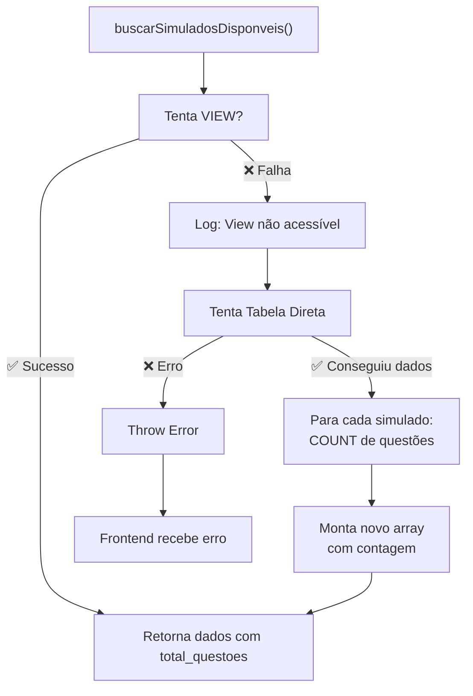

# Guia: Fallback automático para buscar simulados

## 🎯 O que mudou

A função `buscarSimuladosDisponveis()` agora tem **2 estratégias**:

### Estratégia 1: USE VIEW (Rápido)
```
Tenta: vw_simulados_com_questoes (otimizado, menos queries)
       ↓
       [VIEW contém: simulados + contagem de questões agregada]
       ↓
Sucesso ✅ → Retorna dados com total_questoes
```

### Estratégia 2: FALLBACK (Manual)
```
Se VIEW falhar ↓
Tenta: SELECT direto da tabela simulados
       ↓
       Para CADA simulado:
         → COUNT questões em simulado_questoes
       ↓
       Monta array: simulados com total_questoes calculado
Sucesso ✅ → Retorna dados reconstituído
```

---

## 📊 Fluxo de Execução



---

## 🔧 Código Updated

**Antes (frágil):**
```typescript
// Falhava completamente se VIEW não existisse
const { data, error } = await supabase
  .from('vw_simulados_com_questoes')
  .select('*');
if (error) throw error;
```

**Agora (resiliente):**
```typescript
// Tenta VIEW
const { data: dataView, error: errorView } = await supabase
  .from('vw_simulados_com_questoes')
  .select('*');

if (!errorView && dataView) {
  return dataView || []; // Sucesso na primeira tentativa
}

// Se falhar, tenta tabela
const { data: dataTable, error: errorTable } = await supabase
  .from('simulados')
  .select('*')
  .eq('ativo', true);

// Calcula contagem para cada simulado
const simuladosComContagem = await Promise.all(
  dataTable.map(async (sim) => {
    const { count } = await supabase
      .from('simulado_questoes')
      .select('*', { count: 'exact', head: true })
      .eq('id_simulado', sim.id_simulado);
    return { ...sim, total_questoes: count || 0 };
  })
);
```

---

## 📈 Cenários

### Cenário 1: VIEW Existe ✅ (Ideal)
```
1. Supabase Cloud tem vw_simulados_com_questoes criada
2. Usuário autenticado tem acesso (RLS permite)
3. Query direta da VIEW
4. ⚡ Rápido: 1 query
5. ✅ Resultado: Lista de simulados com total_questoes
```

### Cenário 2: VIEW Não Existe ⚠️ (Antes quebraria)
```
1. VIEW não criada em Supabase Cloud (apenas local)
2. Primeira tentativa falha
3. Logger: "View não acessível"
4. Fallback ativa: Query tabela + COUNT por simulado
5. ⏱️ Mais lento: N+1 queries (1 + número de simulados)
6. ✅ Resultado: Mesmo resultado, mas lento
```

### Cenário 3: Erro de Autenticação ❌
```
1. Usuário não autenticado
2. RLS bloqueia acesso
3. VIEW falha (erro de permissão)
4. Tabela também falha
5. ❌ Erro lançado ao frontend
6. Frontend mostra: "Erro ao buscar simulados"
7. Usuário precisa fazer login
```

### Cenário 4: Sem dados ✅
```
1. Tabelas vazias (nenhum simulado criado)
2. VIEW ou tabela retorna array vazio: []
3. ✅ Sem erro, apenas lista vazia
4. Frontend mostra: "Nenhum simulado disponível"
```

---

## 🚀 Benefícios

| Aspecto | Antes | Depois |
|--------|-------|--------|
| **Robustez** | Quebrava sem VIEW | Funciona com/sem VIEW |
| **Desempenho** | N/A | 1 query (VIEW) ou N+1 (fallback) |
| **Debugging** | Erro genérico | Logs claros do que falhou |
| **Compatibilidade** | Exigia VIEW | Funciona direto da tabela |
| **User Experience** | Erro no app | Funciona transparente |

---

## ✅ Testes Necessários

```bash
# 1. Com VIEW criada e acessível
# ❌ Erro ao buscar simulados → ✅ Lista de simulados

# 2. Sem VIEW (remove temporariamente)
# ❌ Erro ao buscar simulados → ✅ Lista de simulados (mais lento)

# 3. Sem dados
# ❌ Erro ao buscar simulados → ✅ Lista vazia

# 4. Usuário não autenticado
# ❌ Erro ao buscar simulados → ❌ Erro de autenticação (correto)
```

---

## 📌 Próximos Passos

1. **CRÍTICO**: Execute `DEBUG_SIMULADOS.sql` em Supabase
   - Verifica se VIEW existe
   - Cria VIEW se não existir
   - Concede permissões

2. **IMPORTANTE**: Rebuild & refresh app
   ```bash
   npm run build   # ou no dev: Vite recompila
   ```
   Refresh no browser: `Cmd+Shift+R` (hard refresh)

3. **TESTE**: Abra sidebar, veja se carrega simulados

4. **MONITORAMENTO**: Abra DevTools → Console
   - Se VIEW funciona: nenhum log
   - Se fallback ativa: log "View não acessível"
   - Se erro: log com detalhes

---

## 🔍 Como saber se funciona?

### Sucesso ✅
```
Sidebar mostra:
- "Simulado 1" com botão "Iniciar"
- "Simulado 2" com botão "Refazer"
Console log: (vazio ou "View não acessível" se fallback)
```

### Ainda com erro ❌
```
Sidebar mostra:
- "Erro ao buscar simulados"
Console log: Erro específico de autenticação ou conexão
Ação: Verifique RLS policies e autenticação do usuário
```

---

## 🛠️ Troubleshooting

**Problema**: "Erro ao buscar simulados" persiste
**Solução**:
1. Execute DEBUG_SIMULADOS.sql
2. Rode: `SELECT * FROM vw_simulados_com_questoes LIMIT 1`
3. Se erro: VIEW não existe, recrie com migration
4. Se sem dados: Insira dados com SEED

**Problema**: Carrega muito lento
**Solução**:
1. Verifique DevTools → Network
2. Se muitos requests: Fallback ativado
3. Crie VIEW em Supabase Cloud para otimizar

**Problema**: "Dados incorretos"
**Solução**:
1. Verifique RLS policies em simulados table
2. Check user permissions (anon vs authenticated)
3. Execute: `SELECT * FROM simulados WHERE ativo = true LIMIT 1`
