# 🏗️ ARQUITETURA CANÔNICA - SDR JURÍDICO

**Versão:** 1.0.0  
**Data:** 27 de janeiro de 2026  
**Status:** 📋 Documentação Base

---

## 📊 VISÃO GERAL

Sistema de gestão jurídica construído com arquitetura modular, escalável e baseada em princípios de Clean Architecture e Domain-Driven Design.

---

## 🎯 PRINCÍPIOS ARQUITETURAIS

### 1. Separação de Responsabilidades
- **Apresentação** (UI Components)
- **Lógica de Negócio** (Services/Hooks)
- **Dados** (API/Supabase)
- **Estado** (Contexts/State Management)

### 2. Inversão de Dependências
- Camadas externas dependem de camadas internas
- Abstrações não dependem de implementações

### 3. Single Source of Truth
- Estado centralizado via Contexts
- Cache gerenciado pelo Supabase Client

### 4. Composição sobre Herança
- Componentes reutilizáveis via composição
- Hooks customizados para lógica compartilhada

---

## 📁 ESTRUTURA DE DIRETÓRIOS CANÔNICA

```
src/
├── 📱 app/                          # Configuração da aplicação
│   ├── routes/                      # Definição de rotas
│   └── providers/                   # Providers globais
│
├── �️ domain/                       # ⭐ CAMADA DE DOMÍNIO
│   ├── entities/                    # Entidades de negócio
│   │   ├── Organization.ts          # Escritório/Tenant
│   │   ├── User.ts                  # Usuário do sistema
│   │   ├── Invitation.ts            # Convite
│   │   ├── Lead.ts
│   │   ├── Case.ts
│   │   ├── Client.ts
│   │   └── ...
│   ├── value-objects/               # Value Objects
│   │   ├── Email.ts
│   │   ├── CNPJ.ts
│   │   ├── OAB.ts
│   │   ├── Phone.ts
│   │   └── Password.ts
│   ├── repositories/                # Contratos de repositórios (Interfaces)
│   │   ├── IOrganizationRepository.ts
│   │   ├── IUserRepository.ts
│   │   ├── IInvitationRepository.ts
│   │   ├── ILeadRepository.ts
│   │   ├── ICaseRepository.ts
│   │   └── ...
│   ├── validators/                  # Validadores de domínio
│   │   ├── organizationValidator.ts
│   │   ├── userValidator.ts
│   │   ├── leadValidator.ts
│   │   └── ...
│   └── errors/                      # Erros de domínio
│       ├── DomainError.ts
│       ├── ValidationError.ts
│       └── BusinessRuleError.ts
│
├── 🎯 application/                  # ⭐ CAMADA DE APLICAÇÃO
│   ├── use-cases/                   # Casos de uso
│   │   ├── organizations/
│   │   │   ├── CreateOrganizationUseCase.ts
│   │   │   ├── UpdateOrganizationUseCase.ts
│   │   │   ├── GenerateInviteLinkUseCase.ts
│   │   │   └── SuspendOrganizationUseCase.ts
│   │   ├── users/
│   │   │   ├── InviteUserUseCase.ts
│   │   │   ├── AcceptInvitationUseCase.ts
│   │   │   ├── ChangeUserRoleUseCase.ts
│   │   │   ├── JoinOrganizationUseCase.ts
│   │   │   └── DeactivateUserUseCase.ts
│   │   ├── auth/
│   │   │   ├── LoginUseCase.ts
│   │   │   ├── LogoutUseCase.ts
│   │   │   └── RefreshTokenUseCase.ts
│   │   ├── leads/
│   │   │   ├── CreateLeadUseCase.ts
│   │   │   ├── ConvertLeadToClientUseCase.ts
│   │   │   └── AssignLeadUseCase.ts
│   │   ├── cases/
│   │   │   ├── CreateCaseUseCase.ts
│   │   │   ├── AssignLawyerUseCase.ts
│   │   │   └── UpdateCaseStatusUseCase.ts
│   │   └── ...
│   ├── dtos/                        # Data Transfer Objects
│   │   ├── CreateOrganizationDto.ts
│   │   ├── InviteUserDto.ts
│   │   ├── CreateLeadDto.ts
│   │   ├── UpdateUserDto.ts
│   │   └── ...
│   ├── mappers/                     # Mapeadores
│   │   ├── OrganizationMapper.ts
│   │   ├── UserMapper.ts
│   │   ├── LeadMapper.ts
│   │   └── ...
│   └── ports/                       # Portas (interfaces de serviços)
│       ├── IEmailService.ts
│       ├── IStorageService.ts
│       ├── INotificationService.ts
│       └── IAuditLogService.ts
│
├── 🏗️ infrastructure/               # ⭐ CAMADA DE INFRAESTRUTURA
│   ├── repositories/                # Implementações de repositórios
│   │   ├── SupabaseOrganizationRepository.ts
│   │   ├── SupabaseUserRepository.ts
│   │   ├── SupabaseInvitationRepository.ts
│   │   ├── SupabaseLeadRepository.ts
│   │   ├── SupabaseCaseRepository.ts
│   │   └── ...
│   ├── services/                    # Implementações de services
│   │   ├── EmailService.ts
│   │   ├── StorageService.ts
│   │   ├── NotificationService.ts
│   │   └── AuditLogService.ts
│   ├── http/                        # Configuração HTTP
│   │   ├── api-client.ts
│   │   ├── interceptors.ts
│   │   └── error-handler.ts
│   └── cache/                       # Cache layer
│       ├── CacheService.ts
│       └── cache-config.ts
│
├── 🎨 presentation/                 # ⭐ CAMADA DE APRESENTAÇÃO
│   ├── components/
│   │   ├── ui/                      # Design System
│   │   │   ├── Button/
│   │   │   │   ├── Button.tsx
│   │   │   │   ├── Button.test.tsx
│   │   │   │   ├── Button.stories.tsx
│   │   │   │   └── Button.module.css
│   │   │   ├── Input/
│   │   │   ├── Card/
│   │   │   ├── Modal/
│   │   │   └── ...
│   │   ├── features/                # Componentes por feature
│   │   │   ├── organizations/
│   │   │   │   ├── OrganizationForm.tsx
│   │   │   │   ├── OrganizationCard.tsx
│   │   │   │   └── PlanSelector.tsx
│   │   │   ├── users/
│   │   │   │   ├── UsersList.tsx
│   │   │   │   ├── UserCard.tsx
│   │   │   │   ├── InviteUserModal.tsx
│   │   │   │   ├── RoleSelector.tsx
│   │   │   │   └── PermissionMatrix.tsx
│   │   │   ├── leads/
│   │   │   │   ├── LeadCard.tsx
│   │   │   │   ├── LeadForm.tsx
│   │   │   │   └── LeadDrawer.tsx
│   │   │   ├── cases/
│   │   │   │   ├── CaseCard.tsx
│   │   │   │   ├── CaseForm.tsx
│   │   │   │   └── CaseTimeline.tsx
│   │   │   ├── clients/
│   │   │   └── ...
│   │   └── layout/                  # Layouts
│   │       ├── AppShell.tsx
│   │       ├── Header.tsx
│   │       ├── Sidebar.tsx
│   │       └── Footer.tsx
│   ├── pages/                       # Páginas
│   │   ├── organizations/
│   │   │   ├── CadastroEscritorioPage.tsx
│   │   │   └── ConfigOrganizationPage.tsx
│   │   ├── users/
│   │   │   ├── EquipePage.tsx
│   │   │   ├── InviteUserPage.tsx
│   │   │   └── AcceptInvitationPage.tsx
│   │   ├── fartech/
│   │   │   ├── FartechDashboard.tsx
│   │   │   ├── OrganizationsList.tsx
│   │   │   └── SystemHealth.tsx
│   │   ├── DashboardPage.tsx
│   │   ├── LeadsPage.tsx
│   │   ├── CasesPage.tsx
│   │   └── ...
│   ├── hooks/                       # Custom hooks
│   │   ├── useOrganization.ts
│   │   ├── useUsers.ts
│   │   ├── useInvitations.ts
│   │   ├── usePermissions.ts
│   │   ├── useAuth.ts
│   │   └── ...
│   └── view-models/                 # ViewModels (lógica de apresentação)
│       ├── DashboardViewModel.ts
│       └── UserManagementViewModel.ts
│
├── 🔧 shared/                       # ⭐ CÓDIGO COMPARTILHADO
│   ├── constants/
│   │   ├── roles.ts                 # Roles do sistema
│   │   ├── permissions.ts           # Permissões
│   │   ├── plans.ts                 # Planos
│   │   └── routes.ts
│   ├── enums/
│   │   ├── UserRole.ts
│   │   ├── OrganizationStatus.ts
│   │   ├── CaseStatus.ts
│   │   └── LeadStatus.ts
│   ├── types/
│   │   ├── models/
│   │   ├── api/
│   │   └── ui/
│   ├── utils/
│   │   ├── formatters/
│   │   ├── validators/
│   │   └── helpers/
│   └── errors/
│       ├── AppError.ts
│       ├── NotFoundError.ts
│       ├── UnauthorizedError.ts
│       └── BusinessError.ts
│
├── ⚙️ config/                       # ⭐ CONFIGURAÇÕES
│   ├── environment.ts               # Variáveis de ambiente
│   ├── routes.ts                    # Configuração de rotas
│   ├── permissions.ts               # Matriz de permissões
│   └── supabase.ts                  # Config Supabase
│
├── 🧪 tests/                        # ⭐ TESTES
│   ├── unit/
│   │   ├── domain/
│   │   ├── use-cases/
│   │   └── services/
│   ├── integration/
│   │   └── repositories/
│   ├── e2e/
│   │   └── flows/
│   ├── fixtures/
│   └── mocks/
│
├── 📚 lib/                          # Bibliotecas e configurações
│   ├── supabase.ts                  # Cliente Supabase
│   ├── errors.ts                    # Error handling
│   ├── health.ts                    # Health check
│   └── retry.ts                     # Retry logic
│
├── 🎨 styles/                       # Estilos globais
│   ├── globals.css
│   ├── themes/
│   └── variables/
│
├── 🎭 theme/                        # Sistema de design
│   ├── colors.ts
│   ├── typography.ts
│   └── spacing.ts
│
└── 🖼️ assets/                       # Assets estáticos
    ├── images/
    ├── icons/
    └── fonts/
```

---

## 🏗️ ARQUITETURA MULTI-TENANT

### Hierarquia do Sistema

```
┌─────────────────────────────────────────────────────────────┐
│                    FARTECH (Admin Global)                    │
│            Gerencia múltiplos escritórios/tenants            │
└─────────────────────────────────────────────────────────────┘
                            │
        ┌───────────────────┼───────────────────┐
        ▼                   ▼                   ▼
┌───────────────┐  ┌───────────────┐  ┌───────────────┐
│ Escritório A  │  │ Escritório B  │  │ Escritório C  │
│ (Tenant)      │  │ (Tenant)      │  │ (Tenant)      │
└───────────────┘  └───────────────┘  └───────────────┘
        │
        ├─ 👤 Gestor (Owner)          → Controle total
        ├─ 👨‍⚖️ Advogados             → Gerenciar casos
        ├─ 👥 Associados             → Acesso limitado
        └─ 📊 Equipe Administrativa  → Operações
```

### Roles e Hierarquia

```typescript
enum UserRole {
  FARTECH_ADMIN = 'fartech_admin',    // Admin da plataforma
  ORG_OWNER = 'org_owner',            // Dono do escritório
  ORG_ADMIN = 'org_admin',            // Admin do escritório
  ADVOGADO = 'advogado',              // Advogado
  ASSOCIADO = 'associado',            // Associado
  ADMINISTRATIVO = 'administrativo'    // Equipe administrativa
}
```

---

## 🔄 FLUXO DE DADOS (Clean Architecture)

```
┌─────────────────────────────────────────────────────────────┐
│                        USUÁRIO                               │
└──────────────────────┬──────────────────────────────────────┘
                       │
                       ▼
┌─────────────────────────────────────────────────────────────┐
│              CAMADA DE APRESENTAÇÃO (UI)                     │
│  ┌──────────────┐  ┌──────────────┐  ┌──────────────┐      │
│  │   Pages      │  │  Components  │  │    Hooks     │      │
│  │  (React)     │  │    (UI)      │  │  (State)     │      │
│  └──────────────┘  └──────────────┘  └──────────────┘      │
└──────────────────────┬──────────────────────────────────────┘
                       │
                       ▼
┌─────────────────────────────────────────────────────────────┐
│              CAMADA DE APLICAÇÃO (Use Cases)                 │
│  ┌────────────────────────────────────────────────────┐     │
│  │  CreateOrganizationUseCase                         │     │
│  │  InviteUserUseCase                                 │     │
│  │  ConvertLeadToClientUseCase                        │     │
│  │  AssignCaseToLawyerUseCase                         │     │
│  └────────────────────────────────────────────────────┘     │
└──────────────────────┬──────────────────────────────────────┘
                       │
                       ▼
┌─────────────────────────────────────────────────────────────┐
│              CAMADA DE DOMÍNIO (Business Logic)              │
│  ┌──────────────┐  ┌──────────────┐  ┌──────────────┐      │
│  │  Entities    │  │ Value Objects│  │  Validators  │      │
│  │ Organization │  │    Email     │  │   Business   │      │
│  │    User      │  │    CNPJ      │  │    Rules     │      │
│  │    Lead      │  │    OAB       │  │              │      │
│  └──────────────┘  └──────────────┘  └──────────────┘      │
│                                                              │
│  ┌────────────────────────────────────────────────────┐     │
│  │        Repositories (Interfaces)                   │     │
│  │  IOrganizationRepository, IUserRepository          │     │
│  └────────────────────────────────────────────────────┘     │
└──────────────────────┬──────────────────────────────────────┘
                       │
                       ▼
┌─────────────────────────────────────────────────────────────┐
│           CAMADA DE INFRAESTRUTURA (Data Access)             │
│  ┌──────────────┐  ┌──────────────┐  ┌──────────────┐      │
│  │ Repositories │  │   Services   │  │     API      │      │
│  │  (Supabase)  │  │    Email     │  │   Cliente    │      │
│  │              │  │  Notification│  │              │      │
│  └──────────────┘  └──────────────┘  └──────────────┘      │
└──────────────────────┬──────────────────────────────────────┘
                       │
                       ▼
┌─────────────────────────────────────────────────────────────┐
│                  BANCO DE DADOS (Supabase)                   │
│  ┌──────────────┐  ┌──────────────┐  ┌──────────────┐      │
│  │organizations │  │    users     │  │    leads     │      │
│  │  invitations │  │    cases     │  │   clients    │      │
│  └──────────────┘  └──────────────┘  └──────────────┘      │
└─────────────────────────────────────────────────────────────┘
```

---

## 🎯 CAMADAS E RESPONSABILIDADES

### 📱 CAMADA 1: Apresentação (UI)

**Responsabilidades:**
- Renderizar interface do usuário
- Capturar interações do usuário
- Exibir dados formatados
- Navegação entre telas

**Componentes:**
- `pages/` - Páginas completas
- `components/ui/` - Componentes de design system
- `components/layout/` - Estrutura de layout
- `components/features/` - Componentes específicos de features

**Regras:**
- ❌ NÃO deve conter lógica de negócio
- ❌ NÃO deve fazer chamadas diretas à API
- ✅ DEVE usar hooks para acessar dados e lógica
- ✅ DEVE ser stateless quando possível
- ✅ DEVE ser testável isoladamente

---

### 🎣 CAMADA 2: Lógica de Aplicação

**Responsabilidades:**
- Gerenciar estado da aplicação
- Orquestrar fluxos de dados
- Implementar regras de negócio
- Cache e otimizações

**Componentes:**
- `hooks/` - Custom hooks (useLeads, useCases, etc.)
- `contexts/` - Gerenciamento de estado global
- `services/` - Lógica de negócio isolada

**Regras:**
- ✅ DEVE encapsular lógica complexa
- ✅ DEVE ser reutilizável
- ✅ DEVE ter testes unitários
- ❌ NÃO deve conhecer detalhes de UI
- ❌ NÃO deve acessar DOM diretamente

---

### 🌐 CAMADA 3: Dados e Integrações

**Responsabilidades:**
- Comunicação com backend (Supabase)
- Persistência de dados
- Sincronização
- Cache de dados

**Componentes:**
- `lib/supabase.ts` - Cliente Supabase configurado
- `services/api/` - Serviços de API
- `types/models/` - Modelos de domínio

**Regras:**
- ✅ DEVE usar TypeScript types
- ✅ DEVE ter tratamento de erros
- ✅ DEVE implementar retry logic
- ✅ DEVE validar dados de entrada/saída
- ❌ NÃO deve expor detalhes de implementação

---

## 🔌 PADRÕES DE INTEGRAÇÃO

### 1. Hooks Customizados (Padrão Recomendado)

```typescript
// hooks/useLeads.ts
export function useLeads() {
  const [leads, setLeads] = useState<Lead[]>([]);
  const [loading, setLoading] = useState(false);
  const [error, setError] = useState<Error | null>(null);

  const fetchLeads = async () => {
    setLoading(true);
    try {
      const data = await leadsService.getAll();
      setLeads(data);
    } catch (err) {
      setError(err as Error);
    } finally {
      setLoading(false);
    }
  };

  const createLead = async (data: CreateLeadDto) => {
    return leadsService.create(data);
  };

  return { leads, loading, error, fetchLeads, createLead };
}
```

### 2. Services (Camada de Dados)

```typescript
// services/api/leads.service.ts
export const leadsService = {
  async getAll(): Promise<Lead[]> {
    const { data, error } = await supabase
      .from('leads')
      .select('*')
      .order('created_at', { ascending: false });
    
    if (error) throw error;
    return data;
  },

  async create(lead: CreateLeadDto): Promise<Lead> {
    const { data, error } = await supabase
      .from('leads')
      .insert(lead)
      .select()
      .single();
    
    if (error) throw error;
    return data;
  }
};
```

### 3. Uso em Componentes

```typescript
// pages/Leads/LeadsPage.tsx
export function LeadsPage() {
  const { leads, loading, fetchLeads } = useLeads();

  useEffect(() => {
    fetchLeads();
  }, []);

  if (loading) return <LoadingSpinner />;

  return (
    <div>
      <LeadsList leads={leads} />
    </div>
  );
}
```

---

## 🎨 DESIGN SYSTEM

### Componentes Base (ui/)

```
ui/
├── Button/
│   ├── Button.tsx
│   ├── Button.test.tsx
│   └── Button.stories.tsx
├── Input/
├── Card/
├── Modal/
└── ...
```

**Regras:**
- ✅ Componentes puros e reutilizáveis
- ✅ Suporte a variantes (primary, secondary, etc.)
- ✅ Acessibilidade (ARIA)
- ✅ Responsivo por padrão
- ✅ Documentado com Storybook (quando disponível)

---

## 🔐 SEGURANÇA

### Multi-Tenant Isolation

**Todas as operações devem respeitar o tenant (organization_id):**

```typescript
// ✅ CORRETO - Filtra por organização
const leads = await supabase
  .from('leads')
  .select('*')
  .eq('organization_id', currentUser.organizationId);

// ❌ ERRADO - Sem filtro de organização
const leads = await supabase
  .from('leads')
  .select('*');
```

### Row Level Security (RLS)

Todas as tabelas devem implementar RLS:

```sql
-- Exemplo: Leads por tenant
CREATE POLICY "Users can view own tenant leads"
  ON leads FOR SELECT
  USING (organization_id = (
    SELECT organization_id FROM users
    WHERE id = auth.uid()
  ));

CREATE POLICY "Users can insert own tenant leads"
  ON leads FOR INSERT
  WITH CHECK (organization_id = (
    SELECT organization_id FROM users
    WHERE id = auth.uid()
  ));

-- Exemplo: Fartech admins podem ver tudo
CREATE POLICY "Fartech admins can view all"
  ON leads FOR SELECT
  USING (
    EXISTS (
      SELECT 1 FROM users
      WHERE users.id = auth.uid()
      AND users.role = 'fartech_admin'
    )
  );
```

### Sistema de Permissões

**Matriz de Permissões por Role:**

| Role | Usuários | Leads | Casos | Clientes | Docs | Config | Billing |
|------|----------|-------|-------|----------|------|--------|---------|
| **fartech_admin** | ✅ Todos | ✅ Todos | ✅ Todos | ✅ Todos | ✅ Todos | ✅ Todos | ✅ Todos |
| **org_owner** | ✅ Org | ✅ Org | ✅ Org | ✅ Org | ✅ Org | ✅ Org | ✅ Org |
| **org_admin** | ✅ Org | ✅ Org | ✅ Org | ✅ Org | ✅ Org | 👁️ Leitura | ❌ Não |
| **advogado** | 👁️ Leitura | ✏️ Editar | ✅ Gerenciar | ✏️ Editar | ✅ Gerenciar | ❌ Não | ❌ Não |
| **associado** | 👁️ Leitura | 👁️ Leitura | 👁️ Leitura | 👁️ Leitura | 👁️ Leitura | ❌ Não | ❌ Não |
| **administrativo** | 👁️ Leitura | ✅ Gerenciar | 👁️ Leitura | ✅ Gerenciar | 👁️ Leitura | ❌ Não | ❌ Não |

**Implementação com Hook:**

```typescript
// hooks/usePermissions.ts
export function usePermissions() {
  const { user } = useAuth();
  
  const can = (action: string, resource: string): boolean => {
    if (user.role === 'fartech_admin') return true;
    
    const permission = permissionsMatrix.find(
      p => p.role === user.role 
        && p.resource === resource 
        && p.action === action
    );
    
    return permission?.allowed || false;
  };
  
  return { can };
}

// Uso em componentes
function LeadsPage() {
  const { can } = usePermissions();
  
  return (
    <div>
      {can('create', 'leads') && (
        <Button onClick={handleCreate}>Novo Lead</Button>
      )}
    </div>
  );
}
```

### Autenticação

```typescript
// contexts/AuthContext.tsx
- useAuth() hook para acesso ao usuário
- Login/Logout centralizado
- Refresh token automático
- Protected routes
- Session management
```

### Auditoria (Audit Logs)

**Todas as ações críticas devem ser registradas:**

```typescript
// infrastructure/services/AuditLogService.ts
export class AuditLogService {
  async log(params: {
    action: string;
    resourceType: string;
    resourceId: string;
    userId: string;
    organizationId: string;
    oldValues?: any;
    newValues?: any;
  }) {
    await supabase.from('audit_logs').insert({
      ...params,
      ip_address: getUserIP(),
      user_agent: getUserAgent(),
      created_at: new Date()
    });
  }
}

// Uso em Use Cases
class CreateLeadUseCase {
  async execute(data: CreateLeadDto) {
    const lead = await this.leadRepo.create(data);
    
    // ✅ Log de auditoria
    await this.auditLog.log({
      action: 'create_lead',
      resourceType: 'leads',
      resourceId: lead.id,
      userId: currentUser.id,
      organizationId: currentUser.organizationId,
      newValues: lead
    });
    
    return lead;
  }
}
```

### Proteção de Rotas

```typescript
// components/ProtectedRoute.tsx
<Route path="/fartech/*" element={
  <RequireRole role="fartech_admin">
    <FartechRoutes />
  </RequireRole>
} />

<Route path="/equipe/*" element={
  <RequirePermission resource="users" action="manage">
    <TeamRoutes />
  </RequirePermission>
} />
```

---

## 🧪 TESTES

### Estrutura de Testes

```
tests/
├── unit/                    # Testes unitários
│   ├── components/
│   ├── hooks/
│   └── services/
├── integration/             # Testes de integração
│   └── flows/
└── e2e/                     # Testes end-to-end
    └── scenarios/
```

### Cobertura Mínima
- Components: 80%
- Hooks: 90%
- Services: 90%
- Utils: 95%

---

## 📊 MONITORAMENTO

### Métricas Essenciais
- Performance (Core Web Vitals)
- Erros e exceções
- Uso de recursos
- Tempo de resposta API

### Ferramentas
- Console de erros (Sentry/similar)
- Analytics (Posthog/similar)
- Logs do Supabase

---

## 🚀 DEPLOY

### Ambientes

```
development  → localhost:5173
staging      → staging.sdrjuridico.com
production   → sdrjuridico.com
```

### CI/CD Pipeline

```yaml
1. Lint → 2. Type Check → 3. Tests → 4. Build → 5. Deploy
```

---

## 📈 PERFORMANCE

### Otimizações
- ✅ Code splitting por rota
- ✅ Lazy loading de componentes
- ✅ Memoização (useMemo, useCallback)
- ✅ Virtualização de listas longas
- ✅ Cache de dados (React Query/SWR)
- ✅ Compressão de assets
- ✅ CDN para assets estáticos

---

## 🔄 VERSIONAMENTO

### Semantic Versioning (SemVer)

```
MAJOR.MINOR.PATCH
1.0.0

MAJOR: Breaking changes
MINOR: New features (backwards compatible)
PATCH: Bug fixes
```

---

## 📚 DOCUMENTAÇÃO

### Docs Obrigatórias
- ✅ README.md - Overview do projeto
- ✅ ARQUITETURA_CANONICA.md - Este documento
- ✅ CONTRIBUTING.md - Guia de contribuição
- ✅ CHANGELOG.md - Histórico de mudanças
- ✅ API.md - Documentação da API

---

## 🎯 PRÓXIMOS PASSOS

### Fase 1: Estruturação (Atual)
- [ ] Validar estrutura de diretórios
- [ ] Documentar componentes existentes
- [ ] Criar guia de estilo de código

### Fase 2: Refatoração
- [ ] Migrar componentes para estrutura canônica
- [ ] Implementar hooks customizados
- [ ] Separar services da camada de apresentação

### Fase 3: Qualidade
- [ ] Implementar testes unitários
- [ ] Implementar testes de integração
- [ ] Setup de CI/CD

### Fase 4: Otimização
- [ ] Performance audit
- [ ] Acessibilidade (a11y) audit
- [ ] SEO optimization

---

## 🗄️ MODELO DE DADOS (Multi-Tenant)

### 📐 Diagrama ER Completo

```mermaid
erDiagram
    %% CORE MULTI-TENANT
    orgs ||--o{ org_members : "tem membros"
    orgs ||--o{ leads : "possui"
    orgs ||--o{ clientes : "possui"
    orgs ||--o{ casos : "possui"
    orgs ||--o{ documentos : "possui"
    orgs ||--o{ agenda : "possui"
    orgs ||--o{ tarefas : "possui"
    orgs ||--o{ audit_logs : "registra"
    orgs ||--o{ org_features : "habilita"
    
    %% USUÁRIOS E PERMISSÕES
    usuarios ||--o{ org_members : "participa"
    usuarios ||--o{ active_sessions : "tem sessões"
    usuarios ||--o{ audit_logs : "executa ações"
    usuarios ||--o{ analytics_events : "gera eventos"
    roles ||--o{ org_members : "define papel"
    roles ||--o{ role_permissions : "possui"
    permissions ||--o{ role_permissions : "pertence a"
    
    %% RELAÇÕES DE NEGÓCIO
    leads }o--|| usuarios : "responsavel"
    leads ||--o{ casos : "converte em"
    clientes ||--o{ casos : "possui"
    clientes ||--o{ agenda : "agendado com"
    casos ||--o{ documentos : "contém"
    casos ||--o{ timeline_events : "registra eventos"
    casos ||--o{ agenda : "agenda"
    casos ||--o{ notificacoes : "gera"
    casos ||--o{ tarefas : "possui"
    
    %% TAREFAS E DOCUMENTOS
    tarefas ||--o{ tarefa_documentos : "solicita"
    tarefa_documentos }o--|| documentos : "vincula"
    
    %% PROCESSOS JURÍDICOS
    casos ||--o{ processos_favoritos : "monitora"
    processos_favoritos ||--o{ historico_consultas : "histórico"
    processos_favoritos ||--o{ movimentacoes_detectadas : "detecta"
    
    orgs {
        uuid id PK
        varchar name
        varchar slug UK
        varchar cnpj UK
        varchar email
        varchar plan "trial,basic,pro,enterprise"
        varchar status "pending,active,suspended,cancelled"
        integer max_users
        integer max_storage_gb
        jsonb settings
        timestamp created_at
    }
    
    org_members {
        uuid id PK
        uuid org_id FK
        uuid user_id FK
        varchar role "admin,gestor,advogado,secretaria,leitura"
        boolean ativo
        uuid invited_by FK
        timestamp created_at
    }
    
    usuarios {
        uuid id PK
        varchar nome_completo
        varchar email UK
        varchar telefone
        text[] permissoes "fartech_admin,org_admin,user"
        varchar status "ativo,inativo,suspenso"
        jsonb preferencias
        timestamp ultimo_acesso
    }
    
    leads {
        uuid id PK
        uuid org_id FK
        varchar nome
        varchar email
        varchar telefone
        varchar status "novo,em_contato,qualificado,ganho,perdido"
        varchar origem
        text responsavel
        timestamp created_at
    }
    
    clientes {
        uuid id PK
        uuid org_id FK
        varchar nome
        varchar email
        varchar cnpj
        varchar cpf
        varchar endereco
        varchar status "ativo,em_risco,inativo"
        timestamp created_at
    }
    
    casos {
        uuid id PK
        uuid org_id FK
        uuid cliente_id FK
        uuid lead_id FK
        varchar titulo
        text descricao
        varchar area
        varchar status "aberto,em_andamento,resolvido,fechado"
        varchar prioridade "baixa,media,alta,critica"
        decimal valor
        text[] tags
        text responsavel
        timestamp data_abertura
    }
    
    documentos {
        uuid id PK
        uuid org_id FK
        uuid caso_id FK
        varchar titulo
        varchar tipo
        varchar status "pendente,aprovado,rejeitado"
        text url
        varchar arquivo_nome
        integer arquivo_tamanho
        text[] tags
        timestamp created_at
    }
    
    tarefas {
        uuid id PK
        uuid org_id FK
        uuid caso_id FK
        uuid assigned_user_id FK
        varchar titulo
        text descricao
        varchar status "pendente,em_progresso,concluida,devolvida"
        varchar prioridade "baixa,media,alta,critica"
        timestamp due_at
        timestamp submitted_at
        timestamp confirmed_at
        uuid confirmed_by FK
        text rejected_reason
    }
    
    tarefa_documentos {
        uuid id PK
        uuid org_id FK
        uuid tarefa_id FK
        uuid documento_id FK
        text label
        boolean solicitado
        boolean entregue
        timestamp delivered_at
    }
    
    agenda {
        uuid id PK
        uuid org_id FK
        uuid cliente_id FK
        uuid caso_id FK
        varchar titulo
        varchar tipo "reuniao,ligacao,audiencia,prazo"
        timestamp data_inicio
        timestamp data_fim
        varchar status "confirmado,pendente,cancelado"
        text responsavel
    }
    
    timeline_events {
        uuid id PK
        uuid org_id FK
        uuid caso_id FK
        varchar titulo
        text descricao
        varchar categoria "docs,agenda,comercial,juridico"
        timestamp data_evento
    }
    
    notificacoes {
        uuid id PK
        uuid org_id FK
        uuid caso_id FK
        uuid cliente_id FK
        varchar titulo
        varchar prioridade "P0,P1,P2"
        boolean lida
        text usuario_responsavel
        timestamp data_notificacao
    }
    
    audit_logs {
        uuid id PK
        uuid org_id FK
        uuid user_id FK
        varchar action "create,update,delete,login"
        varchar entity_type
        uuid entity_id
        jsonb old_data
        jsonb new_data
        inet ip_address
        timestamp created_at
    }
    
    roles {
        uuid id PK
        varchar name UK
        varchar display_name
        boolean is_system
    }
    
    permissions {
        uuid id PK
        varchar name UK
        varchar resource "leads,casos,clientes"
        varchar action "create,read,update,delete"
    }
    
    role_permissions {
        uuid role_id FK
        uuid permission_id FK
    }
    
    org_features {
        uuid id PK
        uuid org_id FK
        varchar feature_key
        boolean enabled
        jsonb metadata
    }
    
    active_sessions {
        uuid id PK
        uuid user_id FK
        uuid org_id FK
        varchar session_token
        inet ip_address
        timestamp last_activity
        timestamp expires_at
    }
    
    analytics_events {
        uuid id PK
        uuid org_id FK
        uuid user_id FK
        uuid session_id
        varchar event_name
        varchar event_type "page_view,button_click,feature_used"
        jsonb properties
        timestamp created_at
    }
    
    processos_favoritos {
        uuid id PK
        uuid caso_id FK
        varchar numero_processo
        varchar tipo_processo
        boolean notificacoes_ativas
        timestamp created_at
    }
    
    historico_consultas {
        uuid id PK
        uuid processo_id FK
        jsonb dados_consulta
        timestamp created_at
    }
    
    movimentacoes_detectadas {
        uuid id PK
        uuid processo_id FK
        text descricao
        boolean lida
        timestamp data_movimentacao
    }
    
    cache_cnpj {
        varchar cnpj PK
        jsonb dados
        timestamp expires_at
    }
```



### 🎯 Análise de Engenharia da Estrutura

#### ✅ Pontos Fortes da Arquitetura Atual

1. **Multi-tenancy Robusto**
   - Isolamento completo por `org_id` em todas as tabelas de negócio
   - Sistema de membros (`org_members`) com roles granulares
   - RLS (Row Level Security) implementado consistentemente

2. **Auditoria e Observabilidade**
   - `audit_logs`: Rastreamento completo de ações
   - `analytics_events`: Tracking de comportamento
   - `active_sessions`: Gerenciamento de sessões ativas

3. **RBAC Dinâmico**
   - Tabelas `roles`, `permissions`, `role_permissions`
   - Permite configuração flexível de permissões
   - Roles do sistema protegidas (`is_system`)

4. **Gestão de Features**
   - `org_features`: Feature flags por organização
   - Permite habilitar/desabilitar funcionalidades por plano

5. **Workflow de Tarefas**
   - Sistema de aprovação com estados (pendente → submetida → confirmada/devolvida)
   - Solicitação de documentos por tarefa
   - Rastreamento de quem confirmou e quando

#### ⚠️ Pontos de Atenção e Melhorias Sugeridas

1. **Inconsistências de Nomenclatura**
   ```sql
   -- PROBLEMA: Mistura de português e inglês
   ❌ leads.heat (inglês) vs casos.prioridade (português)
   ❌ agenda (português) vs active_sessions (inglês)
   ❌ clientes (português) vs users (inglês)
   
   -- SOLUÇÃO: Padronizar para inglês
   ✅ leads, clients, cases, schedules, users
   OU manter português completo
   ✅ leads, clientes, casos, agendamentos, usuarios
   ```

2. **Campos Faltando em Algumas Tabelas**
   ```sql
   -- usuarios: Falta org_id (está em org_members)
   -- Recomendação: Manter como está, pois um usuário pode
   -- pertencer a múltiplas orgs via org_members
   
   -- clientes: Faltam campos de saúde/status conforme schema
   ALTER TABLE clientes ADD COLUMN IF NOT EXISTS health VARCHAR(20) 
     CHECK (health IN ('ok', 'atencao', 'critico'));
   ```

3. **Índices de Performance**
   ```sql
   -- ADICIONAR índices compostos para queries comuns:
   CREATE INDEX idx_casos_org_status_priority 
     ON casos(org_id, status, prioridade);
   
   CREATE INDEX idx_leads_org_status_created 
     ON leads(org_id, status, created_at DESC);
   
   CREATE INDEX idx_agenda_org_responsavel_data 
     ON agenda(org_id, responsavel, data_inicio);
   
   -- Índices para full-text search:
   CREATE INDEX idx_casos_titulo_fts 
     ON casos USING GIN (to_tsvector('portuguese', titulo));
   ```

4. **Soft Delete Pattern**
   ```sql
   -- Implementar soft delete em tabelas críticas
   ALTER TABLE clientes ADD COLUMN deleted_at TIMESTAMPTZ;
   ALTER TABLE casos ADD COLUMN deleted_at TIMESTAMPTZ;
   ALTER TABLE leads ADD COLUMN deleted_at TIMESTAMPTZ;
   
   -- Views para dados ativos
   CREATE VIEW clientes_ativos AS 
     SELECT * FROM clientes WHERE deleted_at IS NULL;
   ```

5. **Versionamento de Documentos**
   ```sql
   -- Adicionar versionamento a documentos
   ALTER TABLE documentos ADD COLUMN version INTEGER DEFAULT 1;
   ALTER TABLE documentos ADD COLUMN parent_id UUID 
     REFERENCES documentos(id);
   
   CREATE INDEX idx_documentos_parent_version 
     ON documentos(parent_id, version DESC);
   ```

6. **Notificações em Tempo Real**
   ```sql
   -- Adicionar suporte a WebSocket/Realtime
   CREATE TABLE notification_subscriptions (
     id UUID PRIMARY KEY DEFAULT gen_random_uuid(),
     user_id UUID REFERENCES usuarios(id),
     org_id UUID REFERENCES orgs(id),
     channel TEXT NOT NULL,
     subscription_data JSONB,
     created_at TIMESTAMPTZ DEFAULT now()
   );
   ```

7. **Cache de Relacionamentos**
   ```sql
   -- Desnormalização estratégica para performance
   ALTER TABLE casos ADD COLUMN cliente_nome TEXT;
   ALTER TABLE casos ADD COLUMN advogado_nome TEXT;
   
   -- Trigger para manter sincronizado
   CREATE TRIGGER update_caso_cliente_nome
     AFTER UPDATE ON clientes
     FOR EACH ROW
     EXECUTE FUNCTION sync_caso_cliente_nome();
   ```

8. **Limites e Quotas**
   ```sql
   -- Tabela para rastrear uso de quotas
   CREATE TABLE org_quotas_usage (
     org_id UUID PRIMARY KEY REFERENCES orgs(id),
     cases_count INTEGER DEFAULT 0,
     users_count INTEGER DEFAULT 0,
     storage_used_mb BIGINT DEFAULT 0,
     updated_at TIMESTAMPTZ DEFAULT now()
   );
   
   -- Função para validar limites
   CREATE FUNCTION check_org_limits()
   RETURNS TRIGGER AS $$
   BEGIN
     -- Validar se org não excedeu limites do plano
     -- Retornar erro se excedeu
   END;
   $$ LANGUAGE plpgsql;
   ```

#### 🚀 Recomendações de Implementação

**FASE 1: Normalização (1 semana)**
- [ ] Padronizar nomenclatura de tabelas e colunas
- [ ] Adicionar campos faltantes conforme schema
- [ ] Criar migration de correção

**FASE 2: Performance (1 semana)**
- [ ] Adicionar índices compostos
- [ ] Implementar full-text search
- [ ] Criar views materializadas para dashboards

**FASE 3: Features Avançadas (2 semanas)**
- [ ] Implementar soft delete
- [ ] Versionamento de documentos
- [ ] Sistema de quotas e limites
- [ ] Notificações em tempo real

**FASE 4: Segurança e Auditoria (1 semana)**
- [ ] Review completo de RLS policies
- [ ] Implementar rate limiting no DB
- [ ] Adicionar logs de acesso sensível
- [ ] Criptografia de campos sensíveis

### 🔐 Row Level Security (RLS) - Status Atual

Todas as tabelas principais implementam RLS:
- ✅ `orgs`, `org_members`, `usuarios`
- ✅ `leads`, `clientes`, `casos`
- ✅ `documentos`, `agenda`, `tarefas`
- ✅ `audit_logs`, `analytics_events`
- ✅ `roles`, `permissions`, `role_permissions`

**Padrão de Policies:**
```sql
-- 1. Fartech admins veem tudo
CREATE POLICY "fartech_admin_all" ON [tabela]
  FOR ALL USING (
    EXISTS (SELECT 1 FROM usuarios 
      WHERE id = auth.uid() 
      AND 'fartech_admin' = ANY(permissoes))
  );

-- 2. Membros da org veem dados da org
CREATE POLICY "org_members_own_data" ON [tabela]
  FOR SELECT USING (
    is_org_member(org_id)
  );

-- 3. Admins da org fazem tudo na org
CREATE POLICY "org_admin_manage" ON [tabela]
  FOR ALL USING (
    is_org_admin_for_org(org_id)
  );
```

---

## 🔄 FLUXOS DE CADASTRO

### 1. Cadastro de Escritório
```
Usuário → Formulário → CreateOrganizationUseCase 
  → Cria Organization + Owner → Email boas-vindas
```

### 2. Convite de Usuário
```
Gestor → InviteUserModal → InviteUserUseCase 
  → Cria Invitation → Email convite → Aceitar convite
```

### 3. Link Mágico
```
Gestor → Gera invite_token → Compartilha link 
  → Usuário solicita → Gestor aprova
```

---

## 📋 PLANO DE IMPLEMENTAÇÃO

Veja o plano completo de implementação em:
- **[PLANO_IMPLEMENTACAO_BACKEND.md](./PLANO_IMPLEMENTACAO_BACKEND.md)** - Backend completo, segurança e multi-tenant
- **[COMPARACAO_ARQUITETURA.md](./COMPARACAO_ARQUITETURA.md)** - Gaps arquiteturais vs Talent Forge

### Fases de Implementação

**FASE 1: Fundamentos (2 semanas)**
- ✅ Criar migrations do banco
- ✅ Domain Layer (entities, value-objects)
- ✅ Repository Pattern

**FASE 2: Use Cases (2 semanas)**
- ✅ Organizations use cases
- ✅ Users/Invitations use cases
- ✅ Leads/Cases use cases

**FASE 3: Frontend (2 semanas)**
- ✅ Cadastro de escritório
- ✅ Gestão de equipe
- ✅ Dashboard Fartech

**FASE 4: Segurança (1 semana)**
- ✅ Sistema de permissões
- ✅ Auditoria completa
- ✅ Testes

**FASE 5: Notificações (1 semana)**
- ✅ Email templates
- ✅ Notificações em tempo real
- ✅ Push notifications

---

## 📞 REFERÊNCIAS

- [React Best Practices](https://react.dev)
- [TypeScript Handbook](https://www.typescriptlang.org/docs/)
- [Supabase Docs](https://supabase.com/docs)
- [Clean Architecture](https://blog.cleancoder.com/uncle-bob/2012/08/13/the-clean-architecture.html)

---

**Mantido por:** Equipe SDR Jurídico  
**Última atualização:** 27 de janeiro de 2026
