# 🏗️ ARQUITETURA CANÔNICA - SDR JURÍDICO

**Versão:** 2.0.0  
**Data:** 5 de fevereiro de 2026  
**Status:** ✅ Produção

---

## 📋 CHANGELOG RECENTE

### v2.0.0 (5 de fevereiro de 2026)
- ✅ **Diário Oficial Page**: Nova página dedicada para busca em diários oficiais via Querido Diário API
- ✅ **Querido Diário Service**: Serviço completo para busca de publicações, processos e dados de empresas (CNPJ)
- ✅ **Querido Diário Proxy**: Edge Function `querido-diario-proxy` para comunicação segura com API Querido Diário
- ✅ **Enriquecimento CNPJ**: Auto-preenchimento de dados de empresas ao cadastrar clientes PJ
- ✅ **Validação CPF/CNPJ**: Validação em tempo real com algoritmo de dígitos verificadores
- ✅ **Formatação Automática**: CPF (000.000.000-00) e CNPJ (00.000.000/0000-00) formatados ao digitar
- ✅ **Detecção Automática PF/PJ**: Sistema detecta automaticamente tipo pelo número de dígitos
- ✅ **ClientesPage Aprimorada**: Indicadores visuais de validação e status de enriquecimento

### v1.9.0 (5 de fevereiro de 2026)
- ✅ **DataJud Auto-Detecção de Tribunal**: Implementada detecção automática do tribunal pelo formato CNJ (J.TR)
- ✅ **DataJud UI Completa**: Exibição completa de todas as informações retornadas pela API DataJud
- ✅ **Fix RLS org_members**: Nova policy `users_see_own_membership` permite usuários verem seus próprios registros
- ✅ **DataJud Proxy Final**: Edge Function `datajud-proxy` com `--no-verify-jwt` funcionando em produção
- ✅ **Partes Processuais**: Renderização completa com polo ativo/passivo, advogados, OAB, documentos
- ✅ **Movimentações Timeline**: Visualização cronológica com complementos tabelados e órgão julgador
- ✅ **Metadados Técnicos**: Exibição de ID DataJud, timestamp, sistema, formato, grau e sigilo

### v1.8.1 (5 de fevereiro de 2026)
- ✅ **OrganizationContext**: Adicionado listener de `onAuthStateChange` para recarregar org automaticamente
- ✅ **Fix Race Condition**: Corrigido problema onde org não era carregada após mudança de porta do servidor
- ✅ **DataJud Proxy**: Nova Edge Function minimalista sem verificação JWT funcionando

### v1.8.0 (5 de fevereiro de 2026)
- ✅ **OrgActiveGuard**: Corrigida ordem de verificações para evitar redirecionamento incorreto
- ✅ **Fluxo de Autenticação**: Usuários não logados agora vão para `/login` (antes iam para `/no-organization`)
- ✅ **DataJud Service**: Reescrito para chamar API DataJud diretamente (sem Edge Function)
- ✅ **API Key DataJud**: Configurada inline no service para simplicidade de uso

### v1.7.0 (5 de fevereiro de 2026)
- ✅ **DocumentoViewer**: Novo componente modal para visualização de documentos (PDF, imagens) inline
- ✅ **Ações no Viewer**: Botões de Aprovar, Rejeitar e Solicitar Novamente direto no modal de visualização
- ✅ **Controles de Visualização**: Zoom, rotação e download para imagens; iframe para PDFs
- ✅ **Geração automática de ID**: Documentos recebem número interno automático no formato `PREFIX-YYYYMMDD-XXXXX`
- ✅ **Prefixos por Tipo**: PI (Petição Inicial), CONT (Contestação), REC (Recurso), PROC (Procuração), CTR (Contrato), etc.
- ✅ **Marcar como Visualizado**: Função para registrar que documento foi visualizado com timestamp e usuário
- ✅ **Download de Documentos**: Função para baixar arquivos via signed URL do Supabase Storage

### v1.6.0 (2 de julho de 2025)
- ✅ **Relacionamentos de Documentos**: Adicionados campos `cliente_id` e `lead_id` na tabela `documentos` como FKs
- ✅ **Soft Delete para Documentos**: Adicionados campos `deleted_at` e `deleted_by` na tabela `documentos`
- ✅ **Novos métodos no Service**: `getDocumentosByCliente()`, `getDocumentosByLead()`, `getDocumentosArquivados()`, `arquivarDocumento()`, `restaurarDocumento()`
- ✅ **Hook useDocumentos expandido**: Novos métodos `fetchByCliente`, `fetchByLead`, `fetchArquivados`, `arquivarDocumento`, `restaurarDocumento`
- ✅ **JOINs otimizados**: Queries agora trazem dados de `casos`, `clientes` e `leads` via JOIN

### v1.5.0 (5 de fevereiro de 2026)
- ✅ **Soft Delete para Leads**: Adicionados campos `deleted_at` e `deleted_by` na tabela `leads`
- ✅ **Soft Delete para Tarefas**: Adicionados campos `deleted_at` e `deleted_by` na tabela `tarefas`
- ✅ **Histórico de Status de Leads**: Nova tabela `lead_status_history` para rastrear mudanças de status e temperatura (heat)
- ✅ **Histórico de Status de Tarefas**: Nova tabela `tarefa_status_history` para rastrear mudanças de status
- ✅ **Página de Tarefas Arquivadas**: Nova página `/app/tarefas/arquivadas` para gerenciar tarefas deletadas
- ✅ **LeadDrawer com Histórico**: Drawer de leads agora exibe timeline de mudanças de status/heat

---

## 📊 VISÃO GERAL

Sistema de gestão jurídica construído com arquitetura modular, escalável e baseada em princípios de Clean Architecture e Domain-Driven Design.

---

## 🎯 PRINCÍPIOS ARQUITETURAIS

### 1. Separação de Responsabilidades
- **Apresentação** (UI Components)
- **Lógica de Negócio** (Services/Hooks)
- **Dados** (API/Supabase)
- **Estado** (Contexts/State Management)

### 2. Inversão de Dependências
- Camadas externas dependem de camadas internas
- Abstrações não dependem de implementações

### 3. Single Source of Truth
- Estado centralizado via Contexts
- Cache gerenciado pelo Supabase Client

### 4. Composição sobre Herança
- Componentes reutilizáveis via composição
- Hooks customizados para lógica compartilhada

---

## 🎨 PALETA DE CORES OFICIAL (NON-NEGOTIABLE)

> **Esta é a paleta oficial do SDR Jurídico. Toda nova feature, componente ou página DEVE usar estas cores via CSS variables. Nunca use valores hex hardcoded.**

### Regra de Ouro
- **As 2 cores SUPERIORES** → para **botões e ações** (CTAs, hover, links ativos)
- **As 2 cores INFERIORES** → para **textos** (títulos, body, labels, captions)

### Paleta Canônica

| Cor | Hex | Variável CSS | Uso |
|-----|-----|-------------|-----|
| 🔴 **Burgundy** | `#721011` | `--brand-primary` | Botões primários, CTAs, links ativos, ícones de ação |
| 🟠 **Amber** | `#BF6F32` | `--brand-accent` | Botões secundários, destaques, badges, hover alternativo |
| 🟤 **Warm Gray** | `#6B5E58` | `--brand-secondary` | Texto secundário, labels, captions, ícones inativos |
| ⚫ **Preto** | `#000000` | `--color-text` | Títulos, headings, texto principal |

### Escala Primary (Burgundy)

```
--brand-primary-900: #4A0B0C  (hover escuro)
--brand-primary-800: #5C0D0E  (pressed)
--brand-primary-700: #721011  ← DEFAULT
--brand-primary-600: #8A1314  (variante média)
--brand-primary-500: #A21617  (variante clara)
--brand-primary-100: #F5E6E6  (bg sutil)
--brand-primary-50:  #FAF3F3  (bg extra sutil)
```

### Escala Accent (Amber)

```
--brand-accent-700: #8F5225  (hover escuro)
--brand-accent-600: #A66029  (pressed)
--brand-accent-500: #BF6F32  ← DEFAULT
--brand-accent-400: #CC8652  (variante média)
--brand-accent-300: #D99D72  (variante clara)
--brand-accent-100: #F5E6DA  (bg sutil)
```

### Escala Neutral (Warm Gray)

```
--color-gray-900: #000000    (texto principal)
--color-gray-800: #2A2522    (títulos fortes)
--color-gray-700: #3D3632    (subtítulos)
--color-gray-600: #6B5E58    ← SECONDARY DEFAULT  
--color-gray-500: #8A7E78    (texto sutil)
--color-gray-400: #A39D98    (disabled)
--color-gray-300: #C3BFB9    (bordas)
--color-gray-200: #E2E0DC    (divisores)
--color-gray-100: #F1F0EE    (bg secundário)
--color-gray-50:  #F8F7F6    (bg base)
```

### Cores Semânticas (estados — NÃO são cores de marca)

| Estado | Cor | Hex | Uso |
|--------|-----|-----|-----|
| ✅ Success | Verde | `#10b981` | Confirmações, status ativo |
| ⚠️ Warning | Amarelo | `#f59e0b` | Avisos, pendências |
| ❌ Danger | Rosa | `#f43f5e` | Erros, ações destrutivas |
| ℹ️ Info | Ciano | `#06b6d4` | Informações, dicas |

### Regras de Implementação

1. **SEMPRE** use `var(--brand-primary)` em vez de `#721011`
2. **SEMPRE** use `var(--brand-accent)` em vez de `#BF6F32`
3. **NUNCA** use `emerald-*`, `green-*` ou `blue-*` do Tailwind para ações de marca
4. Cores semânticas (`green`, `red`, `yellow`) são APENAS para estados (success, danger, warning)
5. O arquivo `src/styles/design-tokens.css` é a **fonte da verdade** para tokens CSS
6. O arquivo `src/styles/force-light.css` NÃO deve sobrescrever cores de marca

---

## 📁 ESTRUTURA DE DIRETÓRIOS CANÔNICA

```
src/
├── 📱 app/                          # Configuração da aplicação
│   ├── routes/                      # Definição de rotas
│   └── providers/                   # Providers globais
│
├── �️ domain/                       # ⭐ CAMADA DE DOMÍNIO
│   ├── entities/                    # Entidades de negócio
│   │   ├── Organization.ts          # Escritório/Tenant
│   │   ├── User.ts                  # Usuário do sistema
│   │   ├── Invitation.ts            # Convite
│   │   ├── Lead.ts
│   │   ├── Case.ts
│   │   ├── Client.ts
│   │   └── ...
│   ├── value-objects/               # Value Objects
│   │   ├── Email.ts
│   │   ├── CNPJ.ts
│   │   ├── OAB.ts
│   │   ├── Phone.ts
│   │   └── Password.ts
│   ├── repositories/                # Contratos de repositórios (Interfaces)
│   │   ├── IOrganizationRepository.ts
│   │   ├── IUserRepository.ts
│   │   ├── IInvitationRepository.ts
│   │   ├── ILeadRepository.ts
│   │   ├── ICaseRepository.ts
│   │   └── ...
│   ├── validators/                  # Validadores de domínio
│   │   ├── organizationValidator.ts
│   │   ├── userValidator.ts
│   │   ├── leadValidator.ts
│   │   └── ...
│   └── errors/                      # Erros de domínio
│       ├── DomainError.ts
│       ├── ValidationError.ts
│       └── BusinessRuleError.ts
│
├── 🎯 application/                  # ⭐ CAMADA DE APLICAÇÃO
│   ├── use-cases/                   # Casos de uso
│   │   ├── organizations/
│   │   │   ├── CreateOrganizationUseCase.ts
│   │   │   ├── UpdateOrganizationUseCase.ts
│   │   │   ├── GenerateInviteLinkUseCase.ts
│   │   │   └── SuspendOrganizationUseCase.ts
│   │   ├── users/
│   │   │   ├── InviteUserUseCase.ts
│   │   │   ├── AcceptInvitationUseCase.ts
│   │   │   ├── ChangeUserRoleUseCase.ts
│   │   │   ├── JoinOrganizationUseCase.ts
│   │   │   └── DeactivateUserUseCase.ts
│   │   ├── auth/
│   │   │   ├── LoginUseCase.ts
│   │   │   ├── LogoutUseCase.ts
│   │   │   └── RefreshTokenUseCase.ts
│   │   ├── leads/
│   │   │   ├── CreateLeadUseCase.ts
│   │   │   ├── ConvertLeadToClientUseCase.ts
│   │   │   └── AssignLeadUseCase.ts
│   │   ├── cases/
│   │   │   ├── CreateCaseUseCase.ts
│   │   │   ├── AssignLawyerUseCase.ts
│   │   │   └── UpdateCaseStatusUseCase.ts
│   │   └── ...
│   ├── dtos/                        # Data Transfer Objects
│   │   ├── CreateOrganizationDto.ts
│   │   ├── InviteUserDto.ts
│   │   ├── CreateLeadDto.ts
│   │   ├── UpdateUserDto.ts
│   │   └── ...
│   ├── mappers/                     # Mapeadores
│   │   ├── OrganizationMapper.ts
│   │   ├── UserMapper.ts
│   │   ├── LeadMapper.ts
│   │   └── ...
│   └── ports/                       # Portas (interfaces de serviços)
│       ├── IEmailService.ts
│       ├── IStorageService.ts
│       ├── INotificationService.ts
│       └── IAuditLogService.ts
│
├── 🏗️ infrastructure/               # ⭐ CAMADA DE INFRAESTRUTURA
│   ├── repositories/                # Implementações de repositórios
│   │   ├── SupabaseOrganizationRepository.ts
│   │   ├── SupabaseUserRepository.ts
│   │   ├── SupabaseInvitationRepository.ts
│   │   ├── SupabaseLeadRepository.ts
│   │   ├── SupabaseCaseRepository.ts
│   │   └── ...
│   ├── services/                    # Implementações de services
│   │   ├── EmailService.ts
│   │   ├── StorageService.ts
│   │   ├── NotificationService.ts
│   │   └── AuditLogService.ts
│   ├── http/                        # Configuração HTTP
│   │   ├── api-client.ts
│   │   ├── interceptors.ts
│   │   └── error-handler.ts
│   └── cache/                       # Cache layer
│       ├── CacheService.ts
│       └── cache-config.ts
│
├── 🎨 presentation/                 # ⭐ CAMADA DE APRESENTAÇÃO
│   ├── components/
│   │   ├── ui/                      # Design System
│   │   │   ├── Button/
│   │   │   │   ├── Button.tsx
│   │   │   │   ├── Button.test.tsx
│   │   │   │   ├── Button.stories.tsx
│   │   │   │   └── Button.module.css
│   │   │   ├── Input/
│   │   │   ├── Card/
│   │   │   ├── Modal/
│   │   │   └── ...
│   │   ├── features/                # Componentes por feature
│   │   │   ├── organizations/
│   │   │   │   ├── OrganizationForm.tsx
│   │   │   │   ├── OrganizationCard.tsx
│   │   │   │   └── PlanSelector.tsx
│   │   │   ├── users/
│   │   │   │   ├── UsersList.tsx
│   │   │   │   ├── UserCard.tsx
│   │   │   │   ├── InviteUserModal.tsx
│   │   │   │   ├── RoleSelector.tsx
│   │   │   │   └── PermissionMatrix.tsx
│   │   │   ├── leads/
│   │   │   │   ├── LeadCard.tsx
│   │   │   │   ├── LeadForm.tsx
│   │   │   │   └── LeadDrawer.tsx
│   │   │   ├── cases/
│   │   │   │   ├── CaseCard.tsx
│   │   │   │   ├── CaseForm.tsx
│   │   │   │   └── CaseTimeline.tsx
│   │   │   ├── clients/
│   │   │   ├── documentos/
│   │   │   │   ├── UploadDocumentos.tsx     # Upload com geração de ID interno
│   │   │   │   └── DocumentoViewer.tsx      # Modal de visualização inline
│   │   │   └── ...
│   │   └── layout/                  # Layouts
│   │       ├── AppShell.tsx
│   │       ├── Header.tsx
│   │       ├── Sidebar.tsx
│   │       └── Footer.tsx
│   ├── pages/                       # Páginas
│   │   ├── organizations/
│   │   │   ├── CadastroEscritorioPage.tsx
│   │   │   └── ConfigOrganizationPage.tsx
│   │   ├── users/
│   │   │   ├── EquipePage.tsx
│   │   │   ├── InviteUserPage.tsx
│   │   │   └── AcceptInvitationPage.tsx
│   │   ├── fartech/
│   │   │   ├── FartechDashboard.tsx
│   │   │   ├── OrganizationsList.tsx
│   │   │   └── SystemHealth.tsx
│   │   ├── DashboardPage.tsx
│   │   ├── LeadsPage.tsx
│   │   ├── CasesPage.tsx
│   │   └── ...
│   ├── hooks/                       # Custom hooks
│   │   ├── useOrganization.ts
│   │   ├── useUsers.ts
│   │   ├── useInvitations.ts
│   │   ├── usePermissions.ts
│   │   ├── useAuth.ts
│   │   └── ...
│   └── view-models/                 # ViewModels (lógica de apresentação)
│       ├── DashboardViewModel.ts
│       └── UserManagementViewModel.ts
│
├── 🔧 shared/                       # ⭐ CÓDIGO COMPARTILHADO
│   ├── constants/
│   │   ├── roles.ts                 # Roles do sistema
│   │   ├── permissions.ts           # Permissões
│   │   ├── plans.ts                 # Planos
│   │   └── routes.ts
│   ├── enums/
│   │   ├── UserRole.ts
│   │   ├── OrganizationStatus.ts
│   │   ├── CaseStatus.ts
│   │   └── LeadStatus.ts
│   ├── types/
│   │   ├── models/
│   │   ├── api/
│   │   └── ui/
│   ├── utils/
│   │   ├── formatters/
│   │   ├── validators/
│   │   └── helpers/
│   └── errors/
│       ├── AppError.ts
│       ├── NotFoundError.ts
│       ├── UnauthorizedError.ts
│       └── BusinessError.ts
│
├── ⚙️ config/                       # ⭐ CONFIGURAÇÕES
│   ├── environment.ts               # Variáveis de ambiente
│   ├── routes.ts                    # Configuração de rotas
│   ├── permissions.ts               # Matriz de permissões
│   └── supabase.ts                  # Config Supabase
│
├── 🧪 tests/                        # ⭐ TESTES
│   ├── unit/
│   │   ├── domain/
│   │   ├── use-cases/
│   │   └── services/
│   ├── integration/
│   │   └── repositories/
│   ├── e2e/
│   │   └── flows/
│   ├── fixtures/
│   └── mocks/
│
├── 📚 lib/                          # Bibliotecas e configurações
│   ├── supabase.ts                  # Cliente Supabase
│   ├── errors.ts                    # Error handling
│   ├── health.ts                    # Health check
│   └── retry.ts                     # Retry logic
│
├── 🎨 styles/                       # Estilos globais
│   ├── globals.css
│   ├── themes/
│   └── variables/
│
├── 🎭 theme/                        # Sistema de design
│   ├── colors.ts
│   ├── typography.ts
│   └── spacing.ts
│
└── 🖼️ assets/                       # Assets estáticos
    ├── images/
    ├── icons/
    └── fonts/
```

---

## 🏗️ ARQUITETURA MULTI-TENANT

### Hierarquia do Sistema

```
┌─────────────────────────────────────────────────────────────┐
│                    FARTECH (Admin Global)                    │
│            Gerencia múltiplos escritórios/tenants            │
└─────────────────────────────────────────────────────────────┘
                            │
        ┌───────────────────┼───────────────────┐
        ▼                   ▼                   ▼
┌───────────────┐  ┌───────────────┐  ┌───────────────┐
│ Escritório A  │  │ Escritório B  │  │ Escritório C  │
│ (Tenant)      │  │ (Tenant)      │  │ (Tenant)      │
└───────────────┘  └───────────────┘  └───────────────┘
        │
        ├─ 👤 Gestor (Owner)          → Controle total
        ├─ 👨‍⚖️ Advogados             → Gerenciar casos
        ├─ 👥 Associados             → Acesso limitado
        └─ 📊 Equipe Administrativa  → Operações
```

### Roles e Hierarquia

```typescript
enum UserRole {
  FARTECH_ADMIN = 'fartech_admin',    // Admin da plataforma
  ORG_OWNER = 'org_owner',            // Dono do escritório
  ORG_ADMIN = 'org_admin',            // Admin do escritório
  ADVOGADO = 'advogado',              // Advogado
  ASSOCIADO = 'associado',            // Associado
  ADMINISTRATIVO = 'administrativo'    // Equipe administrativa
}
```

---

## 🔄 FLUXO DE DADOS (Clean Architecture)

```
┌─────────────────────────────────────────────────────────────┐
│                        USUÁRIO                               │
└──────────────────────┬──────────────────────────────────────┘
                       │
                       ▼
┌─────────────────────────────────────────────────────────────┐
│              CAMADA DE APRESENTAÇÃO (UI)                     │
│  ┌──────────────┐  ┌──────────────┐  ┌──────────────┐      │
│  │   Pages      │  │  Components  │  │    Hooks     │      │
│  │  (React)     │  │    (UI)      │  │  (State)     │      │
│  └──────────────┘  └──────────────┘  └──────────────┘      │
└──────────────────────┬──────────────────────────────────────┘
                       │
                       ▼
┌─────────────────────────────────────────────────────────────┐
│              CAMADA DE APLICAÇÃO (Use Cases)                 │
│  ┌────────────────────────────────────────────────────┐     │
│  │  CreateOrganizationUseCase                         │     │
│  │  InviteUserUseCase                                 │     │
│  │  ConvertLeadToClientUseCase                        │     │
│  │  AssignCaseToLawyerUseCase                         │     │
│  └────────────────────────────────────────────────────┘     │
└──────────────────────┬──────────────────────────────────────┘
                       │
                       ▼
┌─────────────────────────────────────────────────────────────┐
│              CAMADA DE DOMÍNIO (Business Logic)              │
│  ┌──────────────┐  ┌──────────────┐  ┌──────────────┐      │
│  │  Entities    │  │ Value Objects│  │  Validators  │      │
│  │ Organization │  │    Email     │  │   Business   │      │
│  │    User      │  │    CNPJ      │  │    Rules     │      │
│  │    Lead      │  │    OAB       │  │              │      │
│  └──────────────┘  └──────────────┘  └──────────────┘      │
│                                                              │
│  ┌────────────────────────────────────────────────────┐     │
│  │        Repositories (Interfaces)                   │     │
│  │  IOrganizationRepository, IUserRepository          │     │
│  └────────────────────────────────────────────────────┘     │
└──────────────────────┬──────────────────────────────────────┘
                       │
                       ▼
┌─────────────────────────────────────────────────────────────┐
│           CAMADA DE INFRAESTRUTURA (Data Access)             │
│  ┌──────────────┐  ┌──────────────┐  ┌──────────────┐      │
│  │ Repositories │  │   Services   │  │     API      │      │
│  │  (Supabase)  │  │    Email     │  │   Cliente    │      │
│  │              │  │  Notification│  │              │      │
│  └──────────────┘  └──────────────┘  └──────────────┘      │
└──────────────────────┬──────────────────────────────────────┘
                       │
                       ▼
┌─────────────────────────────────────────────────────────────┐
│                  BANCO DE DADOS (Supabase)                   │
│  ┌──────────────┐  ┌──────────────┐  ┌──────────────┐      │
│  │organizations │  │    users     │  │    leads     │      │
│  │  invitations │  │    cases     │  │   clients    │      │
│  └──────────────┘  └──────────────┘  └──────────────┘      │
└─────────────────────────────────────────────────────────────┘
```

---

## 🎯 CAMADAS E RESPONSABILIDADES

### 📱 CAMADA 1: Apresentação (UI)

**Responsabilidades:**
- Renderizar interface do usuário
- Capturar interações do usuário
- Exibir dados formatados
- Navegação entre telas

**Componentes:**
- `pages/` - Páginas completas
- `components/ui/` - Componentes de design system
- `components/layout/` - Estrutura de layout
- `components/features/` - Componentes específicos de features

**Regras:**
- ❌ NÃO deve conter lógica de negócio
- ❌ NÃO deve fazer chamadas diretas à API
- ✅ DEVE usar hooks para acessar dados e lógica
- ✅ DEVE ser stateless quando possível
- ✅ DEVE ser testável isoladamente

---

### 🎣 CAMADA 2: Lógica de Aplicação

**Responsabilidades:**
- Gerenciar estado da aplicação
- Orquestrar fluxos de dados
- Implementar regras de negócio
- Cache e otimizações

**Componentes:**
- `hooks/` - Custom hooks (useLeads, useCases, etc.)
- `contexts/` - Gerenciamento de estado global
- `services/` - Lógica de negócio isolada

**Regras:**
- ✅ DEVE encapsular lógica complexa
- ✅ DEVE ser reutilizável
- ✅ DEVE ter testes unitários
- ❌ NÃO deve conhecer detalhes de UI
- ❌ NÃO deve acessar DOM diretamente

---

### 🌐 CAMADA 3: Dados e Integrações

**Responsabilidades:**
- Comunicação com backend (Supabase)
- Persistência de dados
- Sincronização
- Cache de dados

**Componentes:**
- `lib/supabase.ts` - Cliente Supabase configurado
- `services/api/` - Serviços de API
- `types/models/` - Modelos de domínio

**Regras:**
- ✅ DEVE usar TypeScript types
- ✅ DEVE ter tratamento de erros
- ✅ DEVE implementar retry logic
- ✅ DEVE validar dados de entrada/saída
- ❌ NÃO deve expor detalhes de implementação

---

## 🔌 PADRÕES DE INTEGRAÇÃO

### 1. Hooks Customizados (Padrão Recomendado)

```typescript
// hooks/useLeads.ts
export function useLeads() {
  const [leads, setLeads] = useState<Lead[]>([]);
  const [loading, setLoading] = useState(false);
  const [error, setError] = useState<Error | null>(null);

  const fetchLeads = async () => {
    setLoading(true);
    try {
      const data = await leadsService.getAll();
      setLeads(data);
    } catch (err) {
      setError(err as Error);
    } finally {
      setLoading(false);
    }
  };

  const createLead = async (data: CreateLeadDto) => {
    return leadsService.create(data);
  };

  return { leads, loading, error, fetchLeads, createLead };
}
```

### 2. Services (Camada de Dados)

```typescript
// services/api/leads.service.ts
export const leadsService = {
  async getAll(): Promise<Lead[]> {
    const { data, error } = await supabase
      .from('leads')
      .select('*')
      .order('created_at', { ascending: false });
    
    if (error) throw error;
    return data;
  },

  async create(lead: CreateLeadDto): Promise<Lead> {
    const { data, error } = await supabase
      .from('leads')
      .insert(lead)
      .select()
      .single();
    
    if (error) throw error;
    return data;
  }
};
```

### 3. Uso em Componentes

```typescript
// pages/Leads/LeadsPage.tsx
export function LeadsPage() {
  const { leads, loading, fetchLeads } = useLeads();

  useEffect(() => {
    fetchLeads();
  }, []);

  if (loading) return <LoadingSpinner />;

  return (
    <div>
      <LeadsList leads={leads} />
    </div>
  );
}
```

---

## 🎨 DESIGN SYSTEM

### Componentes Base (ui/)

```
ui/
├── Button/
│   ├── Button.tsx
│   ├── Button.test.tsx
│   └── Button.stories.tsx
├── Input/
├── Card/
├── Modal/
└── ...
```

**Regras:**
- ✅ Componentes puros e reutilizáveis
- ✅ Suporte a variantes (primary, secondary, etc.)
- ✅ Acessibilidade (ARIA)
- ✅ Responsivo por padrão
- ✅ Documentado com Storybook (quando disponível)

---

## 🔐 SEGURANÇA

### Multi-Tenant Isolation

**Todas as operações devem respeitar o tenant (organization_id):**

```typescript
// ✅ CORRETO - Filtra por organização
const leads = await supabase
  .from('leads')
  .select('*')
  .eq('organization_id', currentUser.organizationId);

// ❌ ERRADO - Sem filtro de organização
const leads = await supabase
  .from('leads')
  .select('*');
```

### Row Level Security (RLS)

Todas as tabelas devem implementar RLS:

```sql
-- Exemplo: Leads por tenant
CREATE POLICY "Users can view own tenant leads"
  ON leads FOR SELECT
  USING (organization_id = (
    SELECT organization_id FROM users
    WHERE id = auth.uid()
  ));

CREATE POLICY "Users can insert own tenant leads"
  ON leads FOR INSERT
  WITH CHECK (organization_id = (
    SELECT organization_id FROM users
    WHERE id = auth.uid()
  ));

-- Exemplo: Fartech admins podem ver tudo
CREATE POLICY "Fartech admins can view all"
  ON leads FOR SELECT
  USING (
    EXISTS (
      SELECT 1 FROM users
      WHERE users.id = auth.uid()
      AND users.role = 'fartech_admin'
    )
  );
```

### Sistema de Permissões

**Matriz de Permissões por Role:**

| Role | Usuários | Leads | Casos | Clientes | Docs | Config | Billing |
|------|----------|-------|-------|----------|------|--------|---------|
| **fartech_admin** | ✅ Todos | ✅ Todos | ✅ Todos | ✅ Todos | ✅ Todos | ✅ Todos | ✅ Todos |
| **org_owner** | ✅ Org | ✅ Org | ✅ Org | ✅ Org | ✅ Org | ✅ Org | ✅ Org |
| **org_admin** | ✅ Org | ✅ Org | ✅ Org | ✅ Org | ✅ Org | 👁️ Leitura | ❌ Não |
| **advogado** | 👁️ Leitura | ✏️ Editar | ✅ Gerenciar | ✏️ Editar | ✅ Gerenciar | ❌ Não | ❌ Não |
| **associado** | 👁️ Leitura | 👁️ Leitura | 👁️ Leitura | 👁️ Leitura | 👁️ Leitura | ❌ Não | ❌ Não |
| **administrativo** | 👁️ Leitura | ✅ Gerenciar | 👁️ Leitura | ✅ Gerenciar | 👁️ Leitura | ❌ Não | ❌ Não |

**Implementação com Hook:**

```typescript
// hooks/usePermissions.ts
export function usePermissions() {
  const { user } = useAuth();
  
  const can = (action: string, resource: string): boolean => {
    if (user.role === 'fartech_admin') return true;
    
    const permission = permissionsMatrix.find(
      p => p.role === user.role 
        && p.resource === resource 
        && p.action === action
    );
    
    return permission?.allowed || false;
  };
  
  return { can };
}

// Uso em componentes
function LeadsPage() {
  const { can } = usePermissions();
  
  return (
    <div>
      {can('create', 'leads') && (
        <Button onClick={handleCreate}>Novo Lead</Button>
      )}
    </div>
  );
}
```

### Autenticação

```typescript
// contexts/AuthContext.tsx
- useAuth() hook para acesso ao usuário
- Login/Logout centralizado
- Refresh token automático
- Protected routes
- Session management
```

### 🛡️ Guards de Rotas (v1.8.0)

**Ordem CRÍTICA de verificações nos Guards:**

```typescript
// components/guards/OrgActiveGuard.tsx

// ⚠️ ORDEM OBRIGATÓRIA DE VERIFICAÇÕES:
// 1. Loading de auth → aguarda
// 2. Usuário autenticado? → se não, vai para /login
// 3. Loading de org → aguarda  
// 4. Tem organização? → se não, vai para /no-organization
// 5. Org está ativa? → se não, vai para /org-suspended

export function OrgActiveGuard({ children }) {
  const { user, loading: authLoading } = useAuth()
  const { currentOrg, loading, isLoading } = useOrganization()
  const isFartechAdmin = useIsFartechAdmin()
  const isOrgActive = useIsOrgActive()

  // 1. Aguarda auth carregar
  if (authLoading) {
    return <LoadingSpinner />
  }

  // 2. Não autenticado → login
  if (!user) {
    return <Navigate to="/login" replace />
  }

  // 3. Aguarda org carregar
  if (loading || isLoading) {
    return <LoadingSpinner />
  }

  // 4. Fartech admin bypassa verificação de org
  if (isFartechAdmin) {
    return <>{children}</>
  }

  // 5. Sem organização → página de erro
  if (!currentOrg) {
    return <Navigate to="/no-organization" replace />
  }

  // 6. Org suspensa/cancelada → página de suspensão
  if (!isOrgActive) {
    return <Navigate to="/org-suspended" replace />
  }

  return <>{children}</>
}
```

**Fluxo de Redirecionamento:**
```
Usuário acessa /app/dashboard
         │
         ▼
   authLoading?  ──YES──→ Loading spinner
         │
        NO
         ▼
     user?  ────NO────→ /login
         │
        YES
         ▼
   orgLoading?  ──YES──→ Loading spinner
         │
        NO
         ▼
  isFartechAdmin? ─YES─→ ✅ Renderiza children
         │
        NO
         ▼
   currentOrg?  ──NO───→ /no-organization
         │
        YES
         ▼
   isOrgActive? ──NO───→ /org-suspended
         │
        YES
         ▼
   ✅ Renderiza children
```

### Auditoria (Audit Logs)

**Todas as ações críticas devem ser registradas:**

```typescript
// infrastructure/services/AuditLogService.ts
export class AuditLogService {
  async log(params: {
    action: string;
    resourceType: string;
    resourceId: string;
    userId: string;
    organizationId: string;
    oldValues?: any;
    newValues?: any;
  }) {
    await supabase.from('audit_logs').insert({
      ...params,
      ip_address: getUserIP(),
      user_agent: getUserAgent(),
      created_at: new Date()
    });
  }
}

// Uso em Use Cases
class CreateLeadUseCase {
  async execute(data: CreateLeadDto) {
    const lead = await this.leadRepo.create(data);
    
    // ✅ Log de auditoria
    await this.auditLog.log({
      action: 'create_lead',
      resourceType: 'leads',
      resourceId: lead.id,
      userId: currentUser.id,
      organizationId: currentUser.organizationId,
      newValues: lead
    });
    
    return lead;
  }
}
```

### Proteção de Rotas

```typescript
// components/ProtectedRoute.tsx
<Route path="/fartech/*" element={
  <RequireRole role="fartech_admin">
    <FartechRoutes />
  </RequireRole>
} />

<Route path="/equipe/*" element={
  <RequirePermission resource="users" action="manage">
    <TeamRoutes />
  </RequirePermission>
} />
```

---

## 🧪 TESTES

### Estrutura de Testes

```
tests/
├── unit/                    # Testes unitários
│   ├── components/
│   ├── hooks/
│   └── services/
├── integration/             # Testes de integração
│   └── flows/
└── e2e/                     # Testes end-to-end
    └── scenarios/
```

### Cobertura Mínima
- Components: 80%
- Hooks: 90%
- Services: 90%
- Utils: 95%

---

## 📊 MONITORAMENTO

### Métricas Essenciais
- Performance (Core Web Vitals)
- Erros e exceções
- Uso de recursos
- Tempo de resposta API

### Ferramentas
- Console de erros (Sentry/similar)
- Analytics (Posthog/similar)
- Logs do Supabase

---

## 🚀 DEPLOY

### Ambientes

```
development  → localhost:5173
staging      → staging.sdrjuridico.com
production   → sdrjuridico.com
```

### CI/CD Pipeline

```yaml
1. Lint → 2. Type Check → 3. Tests → 4. Build → 5. Deploy
```

---

## 📈 PERFORMANCE

### Otimizações
- ✅ Code splitting por rota
- ✅ Lazy loading de componentes
- ✅ Memoização (useMemo, useCallback)
- ✅ Virtualização de listas longas
- ✅ Cache de dados (React Query/SWR)
- ✅ Compressão de assets
- ✅ CDN para assets estáticos

---

## 🔄 VERSIONAMENTO

### Semantic Versioning (SemVer)

```
MAJOR.MINOR.PATCH
1.0.0

MAJOR: Breaking changes
MINOR: New features (backwards compatible)
PATCH: Bug fixes
```

---

## 📚 DOCUMENTAÇÃO

### Docs Obrigatórias
- ✅ README.md - Overview do projeto
- ✅ ARQUITETURA_CANONICA.md - Este documento
- ✅ CONTRIBUTING.md - Guia de contribuição
- ✅ CHANGELOG.md - Histórico de mudanças
- ✅ API.md - Documentação da API

---

## 🎯 PRÓXIMOS PASSOS

### Fase 1: Estruturação (Atual)
- [ ] Validar estrutura de diretórios
- [ ] Documentar componentes existentes
- [ ] Criar guia de estilo de código

### Fase 2: Refatoração
- [ ] Migrar componentes para estrutura canônica
- [ ] Implementar hooks customizados
- [ ] Separar services da camada de apresentação

### Fase 3: Qualidade
- [ ] Implementar testes unitários
- [ ] Implementar testes de integração
- [ ] Setup de CI/CD

### Fase 4: Otimização
- [ ] Performance audit
- [ ] Acessibilidade (a11y) audit
- [ ] SEO optimization

---

## 🗄️ MODELO DE DADOS (Multi-Tenant)

### 📐 Diagrama ER Completo

```mermaid
erDiagram
    %% CORE MULTI-TENANT
    orgs ||--o{ org_members : "tem membros"
    orgs ||--o{ leads : "possui"
    orgs ||--o{ clientes : "possui"
    orgs ||--o{ casos : "possui"
    orgs ||--o{ documentos : "possui"
    orgs ||--o{ agenda : "possui"
    orgs ||--o{ tarefas : "possui"
    orgs ||--o{ audit_logs : "registra"
    orgs ||--o{ org_features : "habilita"
    
    %% USUÁRIOS E PERMISSÕES
    usuarios ||--o{ org_members : "participa"
    usuarios ||--o{ active_sessions : "tem sessões"
    usuarios ||--o{ audit_logs : "executa ações"
    usuarios ||--o{ analytics_events : "gera eventos"
    roles ||--o{ org_members : "define papel"
    roles ||--o{ role_permissions : "possui"
    permissions ||--o{ role_permissions : "pertence a"
    
    %% RELAÇÕES DE NEGÓCIO
    leads }o--|| usuarios : "responsavel"
    leads ||--o{ casos : "converte em"
    clientes ||--o{ casos : "possui"
    clientes ||--o{ agenda : "agendado com"
    casos ||--o{ documentos : "contém"
    casos ||--o{ timeline_events : "registra eventos"
    casos ||--o{ agenda : "agenda"
    casos ||--o{ notificacoes : "gera"
    casos ||--o{ tarefas : "possui"
    
    %% TAREFAS E DOCUMENTOS
    tarefas ||--o{ tarefa_documentos : "solicita"
    tarefa_documentos }o--|| documentos : "vincula"
    
    %% PROCESSOS JURÍDICOS
    casos ||--o{ processos_favoritos : "monitora"
    processos_favoritos ||--o{ historico_consultas : "histórico"
    processos_favoritos ||--o{ movimentacoes_detectadas : "detecta"
    
    orgs {
        uuid id PK
        varchar name
        varchar slug UK
        varchar cnpj UK
        varchar email
        varchar plan "trial,basic,pro,enterprise"
        varchar status "pending,active,suspended,cancelled"
        integer max_users
        integer max_storage_gb
        jsonb settings
        timestamp created_at
    }
    
    org_members {
        uuid id PK
        uuid org_id FK
        uuid user_id FK
        varchar role "admin,gestor,advogado,secretaria,leitura"
        boolean ativo
        uuid invited_by FK
        timestamp created_at
    }
    
    usuarios {
        uuid id PK
        varchar nome_completo
        varchar email UK
        varchar telefone
        text[] permissoes "fartech_admin,org_admin,user"
        varchar status "ativo,inativo,suspenso"
        jsonb preferencias
        timestamp ultimo_acesso
    }
    
    leads {
        uuid id PK
        uuid org_id FK
        varchar nome
        varchar email
        varchar telefone
        varchar status "novo,em_contato,qualificado,proposta,ganho,perdido"
        varchar heat "quente,morno,frio"
        varchar origem
        uuid assigned_user_id FK
        text observacoes
        timestamp last_contact_at
        timestamp deleted_at "SOFT DELETE"
        uuid deleted_by FK "SOFT DELETE"
        timestamp created_at
        timestamp updated_at
    }
    
    lead_status_history {
        uuid id PK
        timestamp created_at
        uuid lead_id FK
        uuid org_id FK
        text status_anterior
        text status_novo
        text heat_anterior
        text heat_novo
        uuid changed_by FK
        text changed_by_name
        text motivo
        jsonb metadata
    }
    
    leads ||--o{ lead_status_history : "histórico"
    
    clientes {
        uuid id PK
        uuid org_id FK
        varchar nome
        varchar email
        varchar cnpj
        varchar cpf
        varchar endereco
        varchar status "ativo,em_risco,inativo"
        timestamp created_at
    }
    
    casos {
        uuid id PK
        uuid org_id FK
        uuid cliente_id FK
        uuid lead_id FK
        varchar titulo
        text descricao
        varchar area
        varchar status "aberto,em_andamento,resolvido,fechado"
        varchar prioridade "baixa,media,alta,critica"
        decimal valor
        text[] tags
        text responsavel
        timestamp data_abertura
    }
    
    documentos {
        uuid id PK
        uuid org_id FK
        uuid caso_id FK
        uuid cliente_id FK "NOVO v1.6"
        uuid lead_id FK "NOVO v1.6"
        varchar titulo
        varchar tipo
        varchar status "pendente,aprovado,rejeitado,solicitado,completo"
        text url
        varchar arquivo_nome
        integer arquivo_tamanho
        varchar numero_id "NOVO v1.7 - ID interno gerado"
        jsonb meta "NOVO v1.7 - visualizado, visualizado_at, etc"
        text[] tags
        timestamp created_at
        timestamp deleted_at "SOFT DELETE v1.6"
        uuid deleted_by FK "SOFT DELETE v1.6"
    }
    
    tarefas {
        uuid id PK
        uuid org_id FK
        uuid caso_id FK
        uuid assigned_user_id FK
        varchar titulo
        text descricao
        varchar status "pendente,em_andamento,aguardando_validacao,concluida,cancelada,devolvida"
        varchar prioridade "baixa,normal,alta"
        timestamp due_at
        timestamp submitted_at
        timestamp confirmed_at
        uuid confirmed_by FK
        text rejected_reason
        timestamp deleted_at "SOFT DELETE"
        uuid deleted_by FK "SOFT DELETE"
    }
    
    tarefa_status_history {
        uuid id PK
        timestamp created_at
        uuid tarefa_id FK
        uuid org_id FK
        text status_anterior
        text status_novo
        uuid changed_by FK
        text motivo
        jsonb metadata
    }
    
    tarefas ||--o{ tarefa_status_history : "histórico"
    
    tarefa_documentos {
        uuid id PK
        uuid org_id FK
        uuid tarefa_id FK
        uuid documento_id FK
        text label
        boolean solicitado
        boolean entregue
        timestamp delivered_at
    }
    
    agenda {
        uuid id PK
        uuid org_id FK
        uuid cliente_id FK
        uuid caso_id FK
        varchar titulo
        varchar tipo "reuniao,ligacao,audiencia,prazo"
        timestamp data_inicio
        timestamp data_fim
        varchar status "confirmado,pendente,cancelado"
        text responsavel
    }
    
    timeline_events {
        uuid id PK
        uuid org_id FK
        uuid caso_id FK
        varchar titulo
        text descricao
        varchar categoria "docs,agenda,comercial,juridico"
        timestamp data_evento
    }
    
    notificacoes {
        uuid id PK
        uuid org_id FK
        uuid caso_id FK
        uuid cliente_id FK
        varchar titulo
        varchar prioridade "P0,P1,P2"
        boolean lida
        text usuario_responsavel
        timestamp data_notificacao
    }
    
    audit_logs {
        uuid id PK
        uuid org_id FK
        uuid user_id FK
        varchar action "create,update,delete,login"
        varchar entity_type
        uuid entity_id
        jsonb old_data
        jsonb new_data
        inet ip_address
        timestamp created_at
    }
    
    roles {
        uuid id PK
        varchar name UK
        varchar display_name
        boolean is_system
    }
    
    permissions {
        uuid id PK
        varchar name UK
        varchar resource "leads,casos,clientes"
        varchar action "create,read,update,delete"
    }
    
    role_permissions {
        uuid role_id FK
        uuid permission_id FK
    }
    
    org_features {
        uuid id PK
        uuid org_id FK
        varchar feature_key
        boolean enabled
        jsonb metadata
    }
    
    active_sessions {
        uuid id PK
        uuid user_id FK
        uuid org_id FK
        varchar session_token
        inet ip_address
        timestamp last_activity
        timestamp expires_at
    }
    
    analytics_events {
        uuid id PK
        uuid org_id FK
        uuid user_id FK
        uuid session_id
        varchar event_name
        varchar event_type "page_view,button_click,feature_used"
        jsonb properties
        timestamp created_at
    }
    
    processos_favoritos {
        uuid id PK
        uuid caso_id FK
        varchar numero_processo
        varchar tipo_processo
        boolean notificacoes_ativas
        timestamp created_at
    }
    
    historico_consultas {
        uuid id PK
        uuid processo_id FK
        jsonb dados_consulta
        timestamp created_at
    }
    
    movimentacoes_detectadas {
        uuid id PK
        uuid processo_id FK
        text descricao
        boolean lida
        timestamp data_movimentacao
    }
    
    cache_cnpj {
        varchar cnpj PK
        jsonb dados
        timestamp expires_at
    }
```



### 🎯 Análise de Engenharia da Estrutura

#### ✅ Pontos Fortes da Arquitetura Atual

1. **Multi-tenancy Robusto**
   - Isolamento completo por `org_id` em todas as tabelas de negócio
   - Sistema de membros (`org_members`) com roles granulares
   - RLS (Row Level Security) implementado consistentemente

2. **Auditoria e Observabilidade**
   - `audit_logs`: Rastreamento completo de ações
   - `analytics_events`: Tracking de comportamento
   - `active_sessions`: Gerenciamento de sessões ativas

3. **RBAC Dinâmico**
   - Tabelas `roles`, `permissions`, `role_permissions`
   - Permite configuração flexível de permissões
   - Roles do sistema protegidas (`is_system`)

4. **Gestão de Features**
   - `org_features`: Feature flags por organização
   - Permite habilitar/desabilitar funcionalidades por plano

5. **Workflow de Tarefas**
   - Sistema de aprovação com estados (pendente → submetida → confirmada/devolvida)
   - Solicitação de documentos por tarefa
   - Rastreamento de quem confirmou e quando

#### ⚠️ Pontos de Atenção e Melhorias Sugeridas

1. **Inconsistências de Nomenclatura**
   ```sql
   -- PROBLEMA: Mistura de português e inglês
   ❌ leads.heat (inglês) vs casos.prioridade (português)
   ❌ agenda (português) vs active_sessions (inglês)
   ❌ clientes (português) vs users (inglês)
   
   -- SOLUÇÃO: Padronizar para inglês
   ✅ leads, clients, cases, schedules, users
   OU manter português completo
   ✅ leads, clientes, casos, agendamentos, usuarios
   ```

2. **Campos Faltando em Algumas Tabelas**
   ```sql
   -- usuarios: Falta org_id (está em org_members)
   -- Recomendação: Manter como está, pois um usuário pode
   -- pertencer a múltiplas orgs via org_members
   
   -- clientes: Faltam campos de saúde/status conforme schema
   ALTER TABLE clientes ADD COLUMN IF NOT EXISTS health VARCHAR(20) 
     CHECK (health IN ('ok', 'atencao', 'critico'));
   ```

3. **Índices de Performance**
   ```sql
   -- ADICIONAR índices compostos para queries comuns:
   CREATE INDEX idx_casos_org_status_priority 
     ON casos(org_id, status, prioridade);
   
   CREATE INDEX idx_leads_org_status_created 
     ON leads(org_id, status, created_at DESC);
   
   CREATE INDEX idx_agenda_org_responsavel_data 
     ON agenda(org_id, responsavel, data_inicio);
   
   -- Índices para full-text search:
   CREATE INDEX idx_casos_titulo_fts 
     ON casos USING GIN (to_tsvector('portuguese', titulo));
   ```

4. **Soft Delete Pattern**
   ```sql
   -- Implementar soft delete em tabelas críticas
   ALTER TABLE clientes ADD COLUMN deleted_at TIMESTAMPTZ;
   ALTER TABLE casos ADD COLUMN deleted_at TIMESTAMPTZ;
   ALTER TABLE leads ADD COLUMN deleted_at TIMESTAMPTZ;
   
   -- Views para dados ativos
   CREATE VIEW clientes_ativos AS 
     SELECT * FROM clientes WHERE deleted_at IS NULL;
   ```

5. **Versionamento de Documentos**
   ```sql
   -- Adicionar versionamento a documentos
   ALTER TABLE documentos ADD COLUMN version INTEGER DEFAULT 1;
   ALTER TABLE documentos ADD COLUMN parent_id UUID 
     REFERENCES documentos(id);
   
   CREATE INDEX idx_documentos_parent_version 
     ON documentos(parent_id, version DESC);
   ```

6. **Notificações em Tempo Real**
   ```sql
   -- Adicionar suporte a WebSocket/Realtime
   CREATE TABLE notification_subscriptions (
     id UUID PRIMARY KEY DEFAULT gen_random_uuid(),
     user_id UUID REFERENCES usuarios(id),
     org_id UUID REFERENCES orgs(id),
     channel TEXT NOT NULL,
     subscription_data JSONB,
     created_at TIMESTAMPTZ DEFAULT now()
   );
   ```

7. **Cache de Relacionamentos**
   ```sql
   -- Desnormalização estratégica para performance
   ALTER TABLE casos ADD COLUMN cliente_nome TEXT;
   ALTER TABLE casos ADD COLUMN advogado_nome TEXT;
   
   -- Trigger para manter sincronizado
   CREATE TRIGGER update_caso_cliente_nome
     AFTER UPDATE ON clientes
     FOR EACH ROW
     EXECUTE FUNCTION sync_caso_cliente_nome();
   ```

8. **Limites e Quotas**
   ```sql
   -- Tabela para rastrear uso de quotas
   CREATE TABLE org_quotas_usage (
     org_id UUID PRIMARY KEY REFERENCES orgs(id),
     cases_count INTEGER DEFAULT 0,
     users_count INTEGER DEFAULT 0,
     storage_used_mb BIGINT DEFAULT 0,
     updated_at TIMESTAMPTZ DEFAULT now()
   );
   
   -- Função para validar limites
   CREATE FUNCTION check_org_limits()
   RETURNS TRIGGER AS $$
   BEGIN
     -- Validar se org não excedeu limites do plano
     -- Retornar erro se excedeu
   END;
   $$ LANGUAGE plpgsql;
   ```

#### 🚀 Recomendações de Implementação

**FASE 1: Normalização (1 semana)**
- [ ] Padronizar nomenclatura de tabelas e colunas
- [ ] Adicionar campos faltantes conforme schema
- [ ] Criar migration de correção

**FASE 2: Performance (1 semana)**
- [ ] Adicionar índices compostos
- [ ] Implementar full-text search
- [ ] Criar views materializadas para dashboards

**FASE 3: Features Avançadas (2 semanas)**
- [ ] Implementar soft delete
- [ ] Versionamento de documentos
- [ ] Sistema de quotas e limites
- [ ] Notificações em tempo real

**FASE 4: Segurança e Auditoria (1 semana)**
- [ ] Review completo de RLS policies
- [ ] Implementar rate limiting no DB
- [ ] Adicionar logs de acesso sensível
- [ ] Criptografia de campos sensíveis

### 🔐 Row Level Security (RLS) - Status Atual

Todas as tabelas principais implementam RLS:
- ✅ `orgs`, `org_members`, `usuarios`
- ✅ `leads`, `clientes`, `casos`
- ✅ `documentos`, `agenda`, `tarefas`
- ✅ `audit_logs`, `analytics_events`
- ✅ `roles`, `permissions`, `role_permissions`

**Policy Crítica para org_members:**
```sql
-- Usuários podem ver seus próprios registros de membership
-- IMPORTANTE: Sem isso, usuários não conseguem ver a qual org pertencem
CREATE POLICY "users_see_own_membership" ON org_members
  FOR SELECT USING (user_id = auth.uid());
```

**Padrão de Policies:**
```sql
-- 1. Fartech admins veem tudo
CREATE POLICY "fartech_admin_all" ON [tabela]
  FOR ALL USING (
    EXISTS (SELECT 1 FROM usuarios 
      WHERE id = auth.uid() 
      AND 'fartech_admin' = ANY(permissoes))
  );

-- 2. Membros da org veem dados da org
CREATE POLICY "org_members_own_data" ON [tabela]
  FOR SELECT USING (
    is_org_member(org_id)
  );

-- 3. Admins da org fazem tudo na org
CREATE POLICY "org_admin_manage" ON [tabela]
  FOR ALL USING (
    is_org_admin_for_org(org_id)
  );
```

---

## � INTEGRAÇÃO DATAJUD (v1.9.0)

### 1. Arquitetura da Integração

```
┌─────────────────────────────────────────────────────────────┐
│                    FRONTEND (React)                          │
│  ┌─────────────────────────────────────────────────────┐    │
│  │  DataJudPage.tsx                                    │    │
│  │  - Formulário de busca (número CNJ)                 │    │
│  │  - Auto-detecção de tribunal pelo número            │    │
│  │  - Exibição completa dos resultados                 │    │
│  └──────────────────────┬──────────────────────────────┘    │
│                         │                                    │
│  ┌──────────────────────▼──────────────────────────────┐    │
│  │  datajudService.ts                                   │    │
│  │  - buscarProcessoAutomatico()                        │    │
│  │  - detectarTribunalPorNumero()                       │    │
│  │  - Mapeamento CNJ → Tribunal                        │    │
│  └──────────────────────┬──────────────────────────────┘    │
└─────────────────────────┼───────────────────────────────────┘
                          │ HTTPS
                          ▼
┌─────────────────────────────────────────────────────────────┐
│            SUPABASE EDGE FUNCTION (datajud-proxy)           │
│  ┌─────────────────────────────────────────────────────┐    │
│  │  supabase/functions/datajud-proxy/index.ts          │    │
│  │  - Proxy minimalista (sem verificação JWT)          │    │
│  │  - Adiciona API Key do CNJ aos headers              │    │
│  │  - Repassa request para API DataJud                 │    │
│  └──────────────────────┬──────────────────────────────┘    │
└─────────────────────────┼───────────────────────────────────┘
                          │ HTTPS
                          ▼
┌─────────────────────────────────────────────────────────────┐
│             CNJ DataJud API (api-publica.datajud.cnj.jus.br)│
│  - Endpoint: /{tribunal}/_search                            │
│  - Retorna: Capa processual, movimentações, partes, etc.    │
└─────────────────────────────────────────────────────────────┘
```

### 2. Formato do Número CNJ

```
Formato: NNNNNNN-DD.AAAA.J.TR.OOOO

Onde:
- NNNNNNN = Número sequencial (7 dígitos)
- DD = Dígito verificador (2 dígitos)
- AAAA = Ano de ajuizamento (4 dígitos)
- J = Segmento da Justiça (1 dígito)
- TR = Tribunal/Estado (2 dígitos)
- OOOO = Código da unidade de origem (4 dígitos)

Exemplo: 5007197-20.2024.8.13.0105
         └──────┘ └┘ └──┘ │ └┘ └──┘
         Número  DV Ano   J TR Origem
```

### 3. Mapeamento J (Segmento da Justiça)

```typescript
const SEGMENTOS_JUSTICA = {
  '1': 'STF',     // Supremo Tribunal Federal
  '2': 'CNJ',     // Conselho Nacional de Justiça
  '3': 'STJ',     // Superior Tribunal de Justiça
  '4': 'TRF',     // Justiça Federal (Tribunais Regionais Federais)
  '5': 'TRT',     // Justiça do Trabalho (Tribunais Regionais do Trabalho)
  '6': 'TRE',     // Justiça Eleitoral (Tribunais Regionais Eleitorais)
  '7': 'STM',     // Justiça Militar da União
  '8': 'TJ',      // Justiça dos Estados (Tribunais de Justiça)
  '9': 'TJMMG',   // Justiça Militar Estadual
}
```

### 4. Mapeamento TR (Estado/Região)

```typescript
// Para J=8 (Justiça Estadual) - Código TR = Estado
const ESTADOS_PARA_TJ = {
  '01': 'tjac', '02': 'tjal', '03': 'tjap', '04': 'tjam', '05': 'tjba',
  '06': 'tjce', '07': 'tjdft', '08': 'tjes', '09': 'tjgo', '10': 'tjma',
  '11': 'tjmt', '12': 'tjms', '13': 'tjmg', '14': 'tjpa', '15': 'tjpb',
  '16': 'tjpr', '17': 'tjpe', '18': 'tjpi', '19': 'tjrj', '20': 'tjrn',
  '21': 'tjrs', '22': 'tjro', '23': 'tjrr', '24': 'tjsc', '25': 'tjsp',
  '26': 'tjse', '27': 'tjto'
}

// Para J=4 (Justiça Federal) - Código TR = Região
const REGIOES_PARA_TRF = {
  '01': 'trf1',  // 1ª Região (DF, GO, MG, etc.)
  '02': 'trf2',  // 2ª Região (RJ, ES)
  '03': 'trf3',  // 3ª Região (SP, MS)
  '04': 'trf4',  // 4ª Região (RS, PR, SC)
  '05': 'trf5',  // 5ª Região (NE)
  '06': 'trf6'   // 6ª Região (MG)
}

// Para J=5 (Justiça do Trabalho) - Código TR = Região
const REGIOES_PARA_TRT = {
  '01': 'trt1',  '02': 'trt2',  '03': 'trt3',  '04': 'trt4',  '05': 'trt5',
  '06': 'trt6',  '07': 'trt7',  '08': 'trt8',  '09': 'trt9',  '10': 'trt10',
  '11': 'trt11', '12': 'trt12', '13': 'trt13', '14': 'trt14', '15': 'trt15',
  '16': 'trt16', '17': 'trt17', '18': 'trt18', '19': 'trt19', '20': 'trt20',
  '21': 'trt21', '22': 'trt22', '23': 'trt23', '24': 'trt24'
}
```

### 5. Função de Auto-Detecção de Tribunal

```typescript
function detectarTribunalPorNumero(numero: string): string | null {
  const cleanNumber = numero.replace(/[^\d]/g, '')
  
  if (cleanNumber.length < 14) return null
  
  // Extrair J e TR do número limpo
  const justica = cleanNumber.charAt(9)   // Posição 10 (índice 9)
  const tribunal = cleanNumber.slice(10, 12) // Posições 11-12 (índices 10-11)
  
  switch (justica) {
    case '8': return estadosParaTJ[tribunal]   // Justiça Estadual
    case '4': return regioesParaTRF[tribunal]  // Justiça Federal
    case '5': return regioesParaTRT[tribunal]  // Justiça do Trabalho
    case '6': return `tre${tribunal}`          // Justiça Eleitoral
    default: return null
  }
}
```

### 6. Dados Retornados pela API DataJud

```typescript
interface ProcessoDataJud {
  // Identificação
  id: string                           // ID único no DataJud
  numeroProcesso: string               // Número CNJ
  tribunal: string                     // Sigla do tribunal
  grau: 'G1' | 'G2' | 'SUP'           // 1º Grau, 2º Grau ou Superior
  
  // Metadados
  formato: 'Eletrônico' | 'Físico'
  sistema: string                      // Ex: PJe, PROJUDI, SAJ
  nivelSigilo: number                  // 0 = Público, >0 = Sigiloso
  '@timestamp': string                 // Timestamp da indexação
  dataHoraUltimaAtualizacao: string
  
  // Capa Processual
  classe: { codigo: number, nome: string }
  orgaoJulgador: {
    codigo: number,
    nome: string,
    codigoMunicipioIBGE: string
  }
  dataAjuizamento: string              // Formato: YYYYMMDDHHMMSS
  valorCausa?: number
  
  // Assuntos
  assuntos: Array<{
    codigo: number,
    nome: string
  }>
  
  // Partes
  poloAtivo: Array<{
    nome: string,
    tipoPessoa: 'fisica' | 'juridica',
    numeroDocumentoPrincipal?: string,  // CPF/CNPJ
    advogados?: Array<{
      nome: string,
      numeroOAB?: string
    }>
  }>
  poloPassivo: Array<{ /* mesma estrutura */ }>
  
  // Movimentações
  movimentos: Array<{
    codigo: number,
    nome: string,
    dataHora: string,                   // ISO 8601
    codigoNacional?: number,
    complemento?: string,               // Texto livre
    complementosTabelados?: Array<{
      codigo: number,
      nome: string,
      descricao: string,
      valor?: string
    }>,
    orgaoJulgador?: { nome: string }
  }>
}
```

### 7. Edge Function (datajud-proxy)

**Localização:** `supabase/functions/datajud-proxy/index.ts`

```typescript
// Deploy: npx supabase functions deploy datajud-proxy --no-verify-jwt
import { serve } from 'https://deno.land/std@0.177.0/http/server.ts'

const DATAJUD_API_KEY = Deno.env.get('DATAJUD_API_KEY')

serve(async (req) => {
  const url = new URL(req.url)
  const tribunal = url.searchParams.get('tribunal')
  const numeroProcesso = url.searchParams.get('numeroProcesso')

  const response = await fetch(
    `https://api-publica.datajud.cnj.jus.br/api_publica_${tribunal}/_search`,
    {
      method: 'POST',
      headers: {
        'Authorization': `APIKey ${DATAJUD_API_KEY}`,
        'Content-Type': 'application/json',
      },
      body: JSON.stringify({
        query: {
          match: { numeroProcesso: numeroProcesso.replace(/[^\d]/g, '') }
        }
      }),
    }
  )

  return new Response(await response.text(), {
    headers: { 
      'Content-Type': 'application/json',
      'Access-Control-Allow-Origin': '*'
    }
  })
})
```

**Deploy com flag importante:**
```bash
npx supabase functions deploy datajud-proxy --project-ref xocqcoebreoiaqxoutar --no-verify-jwt
```

### 8. Configuração da API Key

```bash
# Configurar secret no Supabase
npx supabase secrets set DATAJUD_API_KEY="cDZHYzlZa0JadVREZDJCendQbXY6SkJlTzNjLV9TRENyQk1RdnFKZGRQdw==" --project-ref xocqcoebreoiaqxoutar
```

### 9. Fluxo Completo de Busca

```
1. Usuário digita número CNJ: "5007197-20.2024.8.13.0105"

2. Frontend detecta tribunal automaticamente:
   - Extrai J=8 (Justiça Estadual)
   - Extrai TR=13 (Minas Gerais)
   - Retorna: "tjmg"

3. Chama Edge Function:
   GET /functions/v1/datajud-proxy?tribunal=tjmg&numeroProcesso=5007197-20.2024.8.13.0105

4. Edge Function:
   - Adiciona API Key aos headers
   - Faz POST para CNJ DataJud
   - Retorna JSON com hits

5. Frontend renderiza:
   - Capa processual (tribunal, classe, órgão)
   - Datas (ajuizamento, atualização)
   - Valor da causa
   - Partes (polo ativo/passivo com advogados)
   - Assuntos
   - Timeline de movimentações
```

---

## �🔄 FLUXOS DE CADASTRO

### 1. Cadastro de Escritório
```
Usuário → Formulário → CreateOrganizationUseCase 
  → Cria Organization + Owner → Email boas-vindas
```

### 2. Convite de Usuário
```
Gestor → InviteUserModal → InviteUserUseCase 
  → Cria Invitation → Email convite → Aceitar convite
```

### 3. Link Mágico
```
Gestor → Gera invite_token → Compartilha link 
  → Usuário solicita → Gestor aprova
```

---

## 📄 FLUXO DE DOCUMENTOS (v1.7.0)

### 1. Upload de Documento
```
Usuário → UploadDocumentos.tsx
  → Seleciona tipo de documento
  → Sistema gera número ID automático (PREFIX-YYYYMMDD-XXXXX)
  → Upload para Supabase Storage (bucket: documentos)
  → Cria registro na tabela documentos
  → Status inicial: pendente
```

### 2. Prefixos de Documentos por Tipo
```typescript
PREFIXOS_DOCUMENTO = {
  peticao_inicial: 'PI',
  contestacao: 'CONT', 
  recurso: 'REC',
  procuracao: 'PROC',
  contrato: 'CTR',
  acordo: 'ACR',
  certidao: 'CERT',
  alvara: 'ALV',
  sentenca: 'SENT',
  declaracao: 'DECL',
  parecer: 'PAR',
  notificacao: 'NOT',
  citacao: 'CIT',
  intimacao: 'INT',
  oficio: 'OFI',
  outros: 'DOC'
}
// Formato: PREFIX-YYYYMMDD-XXXXX (ex: PI-20260205-84721)
```

### 3. Visualização de Documento
```
Usuário → Clica "Abrir Documento" → DocumentoViewer.tsx
  → Busca signed URL via documentosService.obterUrlDocumento()
  → Renderiza PDF (iframe) ou Imagem (img com zoom/rotação)
  → Marca automaticamente como visualizado (meta.visualizado = true)
```

### 4. Validação de Documento
```
Advogado → Abre documento no modal → Lê conteúdo
  → Pode: Aprovar | Rejeitar | Solicitar Novamente
  → Status atualiza em tempo real no modal
  → Lista de documentos atualiza no fechamento
```

### 5. Ciclo de Status do Documento
```
pendente → aprovado (validado pelo advogado)
pendente → rejeitado (documento incorreto)
pendente → solicitado (pediu nova versão)
rejeitado → pendente (cliente reenviou)
solicitado → pendente (cliente reenviou)
aprovado → completo (processo finalizado)
```

### 6. Estrutura do Campo `meta` (JSONB)
```json
{
  "visualizado": true,
  "visualizado_at": "2026-02-05T10:30:00Z",
  "visualizado_por": "uuid-do-usuario",
  "observacoes": "Documento ok, assinaturas conferidas",
  "versao": 2
}
```

---

## 📋 PLANO DE IMPLEMENTAÇÃO

Veja o plano completo de implementação em:
- **[PLANO_IMPLEMENTACAO_BACKEND.md](./PLANO_IMPLEMENTACAO_BACKEND.md)** - Backend completo, segurança e multi-tenant
- **[COMPARACAO_ARQUITETURA.md](./COMPARACAO_ARQUITETURA.md)** - Gaps arquiteturais vs Talent Forge

### Fases de Implementação (Histórico)

**FASE 1: Fundamentos (2 semanas)** ✅ CONCLUÍDA
- ✅ Criar migrations do banco
- ✅ Domain Layer (entities, value-objects)
- ✅ Repository Pattern

**FASE 2: Use Cases (2 semanas)** ✅ CONCLUÍDA
- ✅ Organizations use cases
- ✅ Users/Invitations use cases
- ✅ Leads/Cases use cases

**FASE 3: Frontend (2 semanas)** ✅ CONCLUÍDA
- ✅ Cadastro de escritório
- ✅ Gestão de equipe
- ✅ Dashboard Fartech

**FASE 4: Segurança (1 semana)** ✅ CONCLUÍDA
- ✅ Sistema de permissões
- ✅ Auditoria completa
- ✅ Testes

**FASE 5: Notificações (1 semana)** ⏳ PARCIAL
- ✅ Email templates
- ⏳ Notificações em tempo real
- ⏳ Push notifications

---

## 📊 ANÁLISE COMPARATIVA: CANÔNICO vs IMPLEMENTADO
**Data da Análise:** 4 de fevereiro de 2026  
**Última Atualização:** 4 de fevereiro de 2026 (Todos os Gaps Críticos Resolvidos)

### Score de Conformidade Geral: **95%** ✅ (era 82%)

| Área | Score | Status |
|------|-------|--------|
| Multi-tenancy | **95%** | ✅ Excelente |
| Segurança (RLS) | **90%** | ✅ Muito Bom |
| Modelo de Dados | **95%** | ✅ Excelente |
| Sistema de Permissões | **95%** | ✅ Corrigido |
| Performance (Índices) | **95%** | ✅ Otimizado |
| Soft Delete | **95%** | ✅ Implementado |
| Enums Documentados | **95%** | ✅ Padronizado |
| Arquitetura de Código | **60%** | ⚠️ Melhorar |

---

## 🔴 GAPS IDENTIFICADOS E PLANO DE CORREÇÃO

### ✅ GAP 1: Role `associado` Não Existe - **RESOLVIDO**
**Prioridade:** 🔴 CRÍTICO  
**Status:** ✅ **IMPLEMENTADO em 04/02/2026**  
**Migration:** `20260204_add_associado_role.sql`

**O que foi feito:**
- ✅ Adicionado valor `associado` ao enum `user_role`
- ✅ Atualizado constraint `org_members_role_check`
- ✅ Adicionadas policies RLS para role associado
- ✅ Documentação de colunas atualizada

---

### GAP 2: Inconsistência de Enums (DB vs Frontend)
**Prioridade:** 🟡 IMPORTANTE  
**Esforço:** 2-3 horas

**Problema:** Mapeamentos complexos entre DB e UI

| Campo | DB | Frontend | Issue |
|-------|-----|----------|-------|
| `leads.status` | `em_triagem` | `em_contato` | Nomes diferentes |
| `casos.status` | `triagem, negociacao, andamento...` | `ativo, suspenso, encerrado` | Muitos → poucos |
| `casos.prioridade` | `INTEGER (1-4)` | `STRING (baixa, media, alta, critica)` | Tipo diferente |

**Ação Necessária:**
1. Criar enums PostgreSQL consistentes
2. Migrar dados existentes
3. Atualizar services para usar tipos corretos

```sql
-- Migration: 20260205_standardize_enums.sql

-- Criar enum para lead_status
CREATE TYPE lead_status_enum AS ENUM (
  'novo', 'em_contato', 'qualificado', 'proposta', 'ganho', 'perdido'
);

-- Criar enum para caso_status
CREATE TYPE caso_status_enum AS ENUM (
  'ativo', 'suspenso', 'encerrado'
);

-- Criar enum para prioridade
CREATE TYPE priority_enum AS ENUM (
  'baixa', 'media', 'alta', 'critica'
);
```

---

### ✅ GAP 3: Índices de Performance Faltando - **RESOLVIDO**
**Prioridade:** 🟡 IMPORTANTE  
**Status:** ✅ **IMPLEMENTADO em 04/02/2026**  
**Migration:** `20260204_add_performance_indexes.sql`

**O que foi feito:**
- ✅ 13 índices compostos criados para queries de dashboard
- ✅ 3 índices GIN para full-text search (português)
- ✅ Índices parciais para dados ativos
- ✅ Índices para Kanban de tarefas

**Índices Criados:**
| Tabela | Índice | Tipo | Uso |
|--------|--------|------|-----|
| casos | `idx_casos_org_status_priority` | B-tree | Dashboard |
| casos | `idx_casos_org_responsavel` | B-tree | Meus Casos |
| casos | `idx_casos_titulo_fts` | GIN | Full-text |
| leads | `idx_leads_org_status_created` | B-tree | Listagem |
| leads | `idx_leads_nome_fts` | GIN | Full-text |
| clientes | `idx_clientes_org_status_nome` | B-tree | Listagem |
| clientes | `idx_clientes_nome_fts` | GIN | Full-text |
| tarefas | `idx_tarefas_org_status_due` | B-tree | Kanban |
| tarefas | `idx_tarefas_org_assigned_status` | B-tree | Minhas Tarefas |
| documentos | `idx_documentos_caso_status` | B-tree | Por caso |
| documentos | `idx_documentos_org_created` | B-tree | Listagem |
| audit_log | `idx_audit_log_date_action` | B-tree | Relatórios |

---

### ✅ GAP 4: Soft Delete Não Implementado - **RESOLVIDO**
**Prioridade:** 🟢 DESEJÁVEL  
**Status:** ✅ **IMPLEMENTADO em 04/02/2026**  
**Migration:** `20260204_soft_delete.sql`

**O que foi feito:**
- ✅ Coluna `deleted_at` e `deleted_by` adicionadas em: clientes, casos, leads, documentos, tarefas
- ✅ Índices parciais para dados ativos (WHERE deleted_at IS NULL)
- ✅ Views de compatibilidade: v_clientes_ativos, v_casos_ativos, etc.
- ✅ Funções helper: `soft_delete()`, `restore_deleted()`, `hard_delete_old()`
- ✅ Audit log integrado às operações de delete/restore

---

### GAP 5: RBAC Dinâmico Não Ativado
**Prioridade:** 🟢 DESEJÁVEL (Futuro)  
**Esforço:** 1-2 semanas

**Status Atual:**
- Tabelas `roles`, `permissions`, `role_permissions` existem mas estão **RESERVADAS**
- Sistema atual usa abordagem simplificada: `usuarios.permissoes[]` + `org_members.role`

**Decisão Arquitetural:**
> O sistema atual é **SUFICIENTE** para a maioria dos casos de uso.  
> RBAC dinâmico será implementado apenas se houver demanda por:
> - Permissões granulares customizáveis por organização
> - Roles personalizados além dos 6 existentes
> - Matriz de permissões editável pelo admin

**Ação:** Manter como está. Documentar que está reservado para futuro.

---

### GAP 6: Clean Architecture Incompleta
**Prioridade:** 🟢 DESEJÁVEL (Refatoração)  
**Esforço:** 2-4 semanas

**Estado Atual:**
```
src/
├── services/    → Infra + App misturados (acesso DB + lógica)
├── hooks/       → App + Presentation misturados
├── types/       → Domain parcial (apenas types)
└── components/  → Presentation OK
```

**Canônica Define:**
```
src/
├── domain/         → Entities, Value Objects, Interfaces
├── application/    → Use Cases, DTOs, Mappers
├── infrastructure/ → Repositories (Supabase)
└── presentation/   → Components, Pages, Hooks
```

**Plano de Refatoração (Incremental):**

1. **Fase A - Domain Layer** (3 dias)
   - Criar `src/domain/entities/` com classes de entidade
   - Criar `src/domain/value-objects/` (Email, CNPJ, OAB)
   - Criar `src/domain/repositories/` (interfaces)

2. **Fase B - Use Cases** (1 semana)
   - Extrair lógica de negócio dos services para use cases
   - Criar `src/application/use-cases/`
   - Criar DTOs para input/output

3. **Fase C - Infrastructure** (3 dias)
   - Renomear `services/` para `infrastructure/repositories/`
   - Implementar interfaces do domain

**Ação:** Criar issue no backlog. Fazer refatoração incremental quando tocar nos arquivos.

---

## 📅 PLANO DE AÇÃO PRIORIZADO

### ✅ Sprint 1 (Concluída) - Correções Críticas
| # | Task | Prioridade | Esforço | Status |
|---|------|------------|---------|--------|
| 1 | Adicionar role `associado` | 🔴 Crítico | 1h | ✅ **Concluído** |
| 2 | Criar índices compostos | 🟡 Importante | 30min | ✅ **Concluído** |
| 3 | Documentar enums existentes | 🟡 Importante | 1h | ✅ **Concluído** |

### ✅ Sprint 2 (Concluída) - Melhorias
| # | Task | Prioridade | Esforço | Status |
|---|------|------------|---------|--------|
| 4 | Padronizar enums DB/Frontend | 🟡 Importante | 3h | ✅ **Concluído** |
| 5 | Implementar soft delete | 🟢 Desejável | 3h | ✅ **Concluído** |
| 6 | Adicionar versionamento docs | 🟢 Desejável | 2h | ⬜ Pendente |

### ✅ Sprint 3 (Concluída) - Kanban e Histórico
| # | Task | Prioridade | Esforço | Status |
|---|------|------------|---------|--------|
| 7 | Tabela `tarefa_status_history` | 🔴 Crítico | 2h | ✅ **Concluído** |
| 8 | Trigger automático de histórico | 🔴 Crítico | 1h | ✅ **Concluído** |
| 9 | Soft delete em tarefas | 🟡 Importante | 1h | ✅ **Concluído** |
| 10 | Drawer completo de tarefas | 🟡 Importante | 3h | ✅ **Concluído** |
| 11 | Ações rápidas no Kanban | 🟡 Importante | 2h | ✅ **Concluído** |
| 12 | Badges de prioridade/status | 🟢 Desejável | 1h | ✅ **Concluído** |

### Backlog (Quando Possível)
| # | Task | Prioridade | Esforço | Status |
|---|------|------------|---------|--------|
| 7 | Refatorar para Clean Architecture | 🟢 Desejável | 2-4 sem | ⬜ Backlog |
| 8 | Ativar RBAC Dinâmico | 🟢 Futuro | 1-2 sem | ⬜ Backlog |
| 9 | Notificações Realtime | 🟢 Desejável | 1 sem | ⬜ Backlog |

---

## 🛠️ SCRIPTS SQL PRONTOS PARA EXECUÇÃO

### Script 1: Adicionar Role Associado
```sql
-- Executar no Supabase SQL Editor
-- Arquivo: supabase/migrations/20260204_add_associado_role.sql

BEGIN;

-- Atualizar constraint
ALTER TABLE org_members 
  DROP CONSTRAINT IF EXISTS org_members_role_check;

ALTER TABLE org_members 
  ADD CONSTRAINT org_members_role_check 
  CHECK (role IN ('admin', 'gestor', 'advogado', 'associado', 'secretaria', 'leitura', 'viewer'));

-- Atualizar enum se existir
DO $$
BEGIN
  IF EXISTS (SELECT 1 FROM pg_type WHERE typname = 'user_role') THEN
    BEGIN
      ALTER TYPE user_role ADD VALUE 'associado' AFTER 'advogado';
    EXCEPTION WHEN duplicate_object THEN
      NULL; -- já existe
    END;
  END IF;
END $$;

-- Documentar
COMMENT ON COLUMN org_members.role IS
  'Role do usuário na organização.
   
   VALORES:
   - admin: Administrador (full access)
   - gestor: Gestor (full access)
   - advogado: Advogado (criar/editar casos, clientes, docs)
   - associado: Advogado associado (acesso limitado a casos atribuídos)
   - secretaria: Secretária (agendamentos, tarefas básicas)
   - leitura: Somente leitura
   - viewer: Visualizador (alias para leitura)';

COMMIT;
```

### Script 2: Índices de Performance
```sql
-- Executar no Supabase SQL Editor
-- Arquivo: supabase/migrations/20260204_add_performance_indexes.sql

BEGIN;

-- Índices compostos para queries comuns
CREATE INDEX IF NOT EXISTS idx_casos_org_status_priority 
  ON casos(org_id, status, prioridade) WHERE status != 'arquivado';

CREATE INDEX IF NOT EXISTS idx_leads_org_status_created 
  ON leads(org_id, status, created_at DESC);

CREATE INDEX IF NOT EXISTS idx_tarefas_org_status_due 
  ON tarefas(org_id, status, due_at) WHERE status NOT IN ('concluida', 'cancelada');

CREATE INDEX IF NOT EXISTS idx_agendamentos_org_date 
  ON agendamentos(org_id, data_inicio, status);

-- Full-text search
CREATE INDEX IF NOT EXISTS idx_casos_titulo_fts 
  ON casos USING GIN (to_tsvector('portuguese', coalesce(titulo, '')));

CREATE INDEX IF NOT EXISTS idx_clientes_nome_fts 
  ON clientes USING GIN (to_tsvector('portuguese', coalesce(nome, '')));

COMMIT;
```

---

## 📞 REFERÊNCIAS

- [React Best Practices](https://react.dev)
- [TypeScript Handbook](https://www.typescriptlang.org/docs/)
- [Supabase Docs](https://supabase.com/docs)
- [Clean Architecture](https://blog.cleancoder.com/uncle-bob/2012/08/13/the-clean-architecture.html)

---

**Mantido por:** Equipe SDR Jurídico  
**Última atualização:** 5 de fevereiro de 2026  
**Versão:** 1.5.0 (Soft Delete Leads + Histórico de Leads)

---

## 📝 CHANGELOG COMPLETO

### v1.5.0 (05/02/2026)
**🎯 Soft Delete e Histórico de Leads**

#### Banco de Dados
- ✅ **Soft Delete para Leads**: Campos `deleted_at` e `deleted_by` na tabela `leads`
- ✅ **`lead_status_history`**: Nova tabela para rastrear mudanças de status e temperatura (heat)
- ✅ **Campos expandidos em `leads`**: `heat`, `last_contact_at`, `assigned_user_id`, `updated_at`

#### Frontend
- ✅ **TarefasArquivadasPage**: Nova página `/app/tarefas/arquivadas`
  - Lista tarefas soft-deleted
  - Botão "Restaurar" para recuperar tarefa
  - Botão "Excluir permanentemente" com confirmação
  - Busca por título/descrição
- ✅ **LeadDrawer com Histórico**: Timeline de mudanças de status e heat
- ✅ **Cards discretos na LeadsPage**: Cores suaves (orange/blue/emerald pastéis)

#### TypeScript (supabaseClient.ts)
- ✅ **LeadRow atualizado**: Campos `deleted_at`, `deleted_by`, `heat`, `assigned_user_id`
- ✅ **TarefaStatusHistoryRow**: Interface para histórico de tarefas
- ✅ **LeadStatusHistoryRow**: Interface para histórico de leads

---

### v1.4.0 (05/02/2026)
**🎯 Kanban Avançado e Auditoria de Tarefas**

#### Banco de Dados
- ✅ **`tarefa_status_history`**: Nova tabela para rastrear todas as mudanças de status
- ✅ **Trigger `trg_tarefa_status_history`**: Registra automaticamente mudanças
- ✅ **Função `get_tarefa_history()`**: Retorna timeline completa com tempo em cada status
- ✅ **View `v_tarefa_timeline`**: Timeline com nome do usuário que fez a mudança
- ✅ **Soft Delete**: Campos `deleted_at` e `deleted_by` na tabela `tarefas`
- ✅ **Filtro automático**: Queries excluem tarefas deletadas (`deleted_at IS NULL`)

#### Frontend (TarefasKanbanPage)
- ✅ **Drawer centralizado**: Modal completo para gerenciamento de tarefa
- ✅ **Ações rápidas contextuais**: Botões baseados no status atual
  - Pendente → "Iniciar Tarefa"
  - Em Andamento → "Enviar p/ Validação" / "Marcar Concluída"
  - Aguardando Validação → "Aprovar" / "Devolver"
  - Concluída/Devolvida → "Reabrir Tarefa"
- ✅ **Badges melhorados**: Prioridade com ícones (🔥 Alta, ➖ Normal, 🔽 Baixa)
- ✅ **Badge animado**: "Atrasada" com pulse vermelho
- ✅ **Seção de devolução**: Input para motivo + confirmação
- ✅ **Histórico de rejeição**: Box amarelo mostrando último motivo

#### Frontend (LeadsPage) - NOVO!
- ✅ **Cards de métricas redesenhados**: Layout 2x2 com gradientes e animações
  - Total Pipeline com ícone de usuários
  - Leads Quentes com badge animado "PRIORIDADE"
  - Em Negociação com indicador de propostas
  - Taxa de Conversão com ícone de sucesso
- ✅ **Cards de lead modernizados**: Hover com elevação, botões com transição
- ✅ **Badges com gradientes**: Status e temperatura com ícones semânticos
  - Status: ✨ Novo, 📞 Em Contato, ⭐ Qualificado, 📋 Proposta, 🎉 Ganho, ❌ Perdido
  - Heat: 🔥 Quente, ☀️ Morno, ❄️ Frio
- ✅ **Tabs redesenhadas**: Container com background, ícones contextuais
- ✅ **Filtros melhorados**: Inputs com ícones, seletores com emojis
- ✅ **Informações de contato**: Email/telefone em chips destacados
- ✅ **Área de interesse**: Badge azul com ícone de pasta

#### Services (tarefasService.ts)
- ✅ **`deleteTarefa()`**: Soft delete com UPDATE em vez de DELETE
- ✅ **`restoreTarefa()`**: Restaura tarefa deletada
- ✅ **`getDeletedTarefas()`**: Lista tarefas na lixeira
- ✅ **Todos os métodos**: Filtram `deleted_at IS NULL`

#### Hooks (useTarefas.ts)
- ✅ **`restoreTarefa`**: Callback para restaurar tarefa
- ✅ **`fetchDeletedTarefas`**: Busca tarefas deletadas

### v1.3.0 (04/02/2026)
- Padronização de enums DB/Frontend
- Índices de performance
- Role `associado` adicionada

### v1.2.0 (03/02/2026)
- Setup inicial multi-tenant
- RLS em todas as tabelas
- Sistema de permissões base
